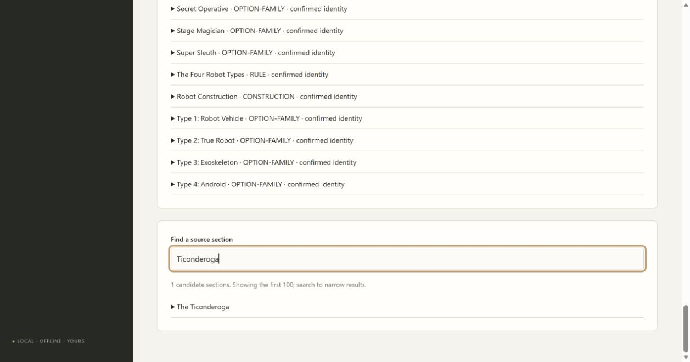

# 02A3 verified PDF gap validation

The original Underseas PDF ends PDF page 130 / printed page 130 during Ticonderoga weapon system 2. Its next PDF page is printed 132, beginning mid-sentence before Stingray/Seadragon. Printed 131 is missing. Later page labels were inspected to confirm the resulting offset. Corrected Markdown lines 8462–8588 cover the Ticonderoga and stop before the next equipment entry.

A separate verified-source-gaps registry binds this finding to both unchanged source hashes. Active coverage and CLI rescans with `--verified-gaps` reconcile it idempotently, without editing books. The source gap blocks all six overlapping candidate headings; the existing Destroyer Borg gap stays visible. Evidence cannot carry over to changed hashes, and ranges must remain within the scanned book. Custom CLI scans without a registry remain supported.

Five focused source-workflow checks pass. Two regressions cover gap reconciliation, source/range failures, CLI scan/rebuild, original bytes, existing gaps and zero claimed mechanical review. A full rescan retains all 13 fingerprints, 7,065 provisional candidates and two gaps. All 95 checks, mypy over 36 files, compilation and JavaScript syntax checks pass (the frozen test runs in Windows CI). Standards caught the custom-CLI regression and missing upper range bound; both are repaired. Both Standards and Spec approve the final changes.

Edge searches The Ticonderoga and displays its source-gap detail. No class or mechanical acceptance is claimed. Recovery is tracked in blocked ticket 02C2; independent supplement audit continues.

