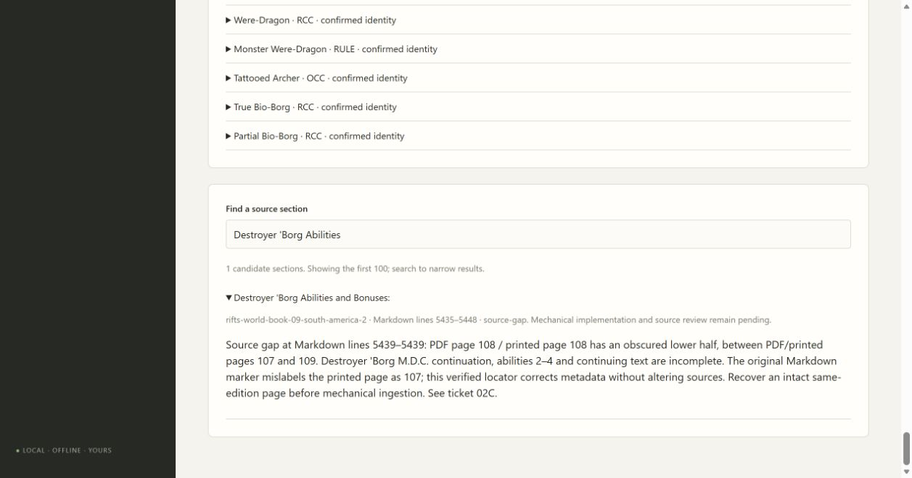

# 02A4 validation

Original South America 2 PDF page 107 visibly ends with the Destroyer Borg heading and shows printed 107; page 109 shows printed 109. The damaged intervening PDF page 108 is therefore printed 108. Earlier source-review Markdown metadata says 107. The verified registry corrects that locator without editing either workstream or original snapshots.

The source-gap reconciler replaces evidence for the identical passage range; separate gaps and blocked status survive, and repeated application is idempotent. The public source workflow checks immutability, separate-gap retention and two active gaps. All 98 checks pass (one frozen-package check reserved for Windows packaging), with mypy, compilation and JavaScript syntax checks. Edge verifies the corrected blocked abilities section and active count of two gaps. Independent Standards and Spec reviews approve with no actionable findings. Missing abilities are not reconstructed.

