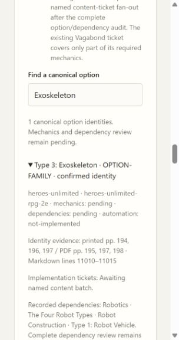

# 02B3 validation

Sixteen Heroes Unlimited core identities expand the canonical catalog from 51 to 67. All numerical mechanics and dependency reviews remain pending; 66 entries still await named content tickets. Builder choices are unchanged.

Original PDF contents pp. 4–5 confirm Hardware names and chapter locators. The Special Training table p. 211 confirms the five paths and aliases. Robot tables/body text pp. 194, 196–197 and construction p. 200 confirm names and the Exoskeleton link to Type 1 pilot rules. This identity pass does not certify numerical mechanics.

`scripts/check.ps1` passes: 79 tests, mypy (29 files), Python compilation and all browser JavaScript syntax checks. The added CharacterApplication coverage test verifies identity counts, named aliases, source locators and robot/category dependency links.

Browser verification: coverage displays 67 identities / 66 awaiting tickets / zero mechanically reviewed or fully automated. Searching Exoskeleton exposes the four recorded dependencies and pending states; searching Manhunter finds Hunter/Vigilante. The original builder remains Human/Vagabond.

Independent Standards and Spec review results are recorded with publication in the implementation progress log.
