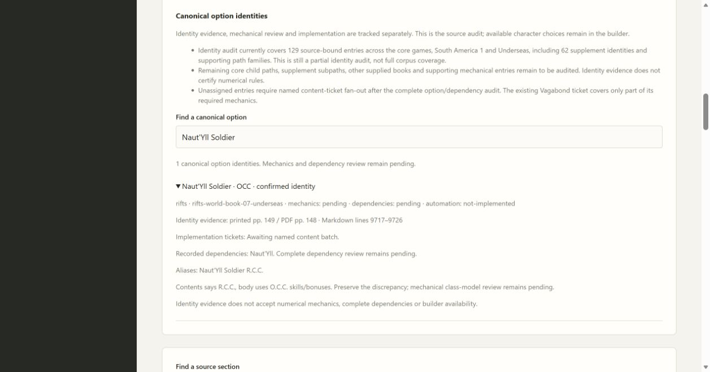

# 02B4 supplement identity validation

Sixty-two South America 1/Underseas source-bound identities extend the canonical catalog from 67 to 129. The current view has 128 identities awaiting content tickets, zero numerical/mechanical acceptances and two source gaps. All new entries keep mechanical/dependency review pending and automation not-implemented. This is a bounded identity pass; remaining child paths, the other supplied books and full content fan-out remain open.

The discovery report identified headings, repeated introductions, aliases and source references in the corrected Markdown. Original South America 1 contents pp. 4–5 and body pp. 97, 102, 107, 117, 134–136 and 152 were inspected; Underseas contents pp. 4–5, body pp. 20, 37–38, 45–47, 96, 98, 148–153, 164 and experience table p. 214 were inspected. The source metadata uses South America 1 PDF page = printed +1; Underseas stays equal through printed 130, then uses printed minus one after its missing printed 131.

Original verification corrected the scout's Ewaipanomas locator to printed 102 and Shaydor to 103. The Rurlel candidate ID in the report was truncated by one character; the catalog uses its complete ID from the inventory. Original Amazon body really says R.C.G.; original Flame Panther contents uses the full name, while the shortened Panther spelling is a Markdown search alias. Naut'Yll Soldier/Koral Shaper contents say R.C.C., while body mechanics use O.C.C. labels; the discrepancy stays explicit for later mechanical review.

Distinct entries retain Werejaguar/Werepanther, Mutant Cat/Felinoid, normal cetaceans/pneuma-bi-forms and Devil Shark/Monster Naut'Yll identities. Shared links connect Aunyain to Totem Warrior, Rurlel Warrior to its race, Tritonian paths to their shared setting rule, Naut'Yll occupations/transformation to their race, and pneuma-bi-forms to Whale Singer. Unavailable external rules remain findings rather than invented accepted dependencies. NPC and exceptional-PC guidance is recorded without an administrative approval gate.

All 96 checks pass, including source/alias/path/offset/gap contracts through CharacterApplication, with mypy, compilation and JavaScript syntax checks (frozen verification runs in Windows CI). Edge finds Ocean Wizard via Ocean Mage and Naut'Yll via the transcription alias Naut'YII; Soldier displays the shared race dependency and printed 149/PDF 148 evidence. Builder choices stay unchanged. Standards caught stale current-count documentation, now repaired. Spec identified a Werejaguar-only candidate in Werepanther provenance; only the shared heading remains, with a regression. Spellsong rule dependencies are explicitly distinguished from mandatory O.C.C. eligibility. Both Standards and targeted Spec re-review approve.

