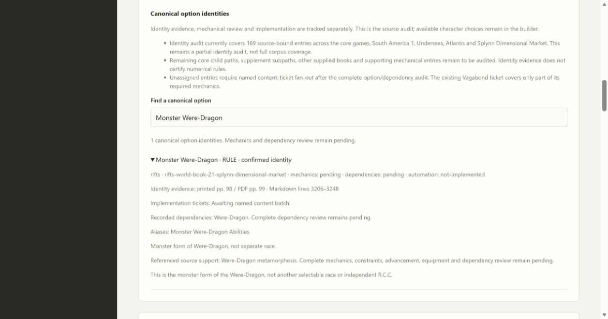

# 02B5 validation

Forty Atlantis and Splynn Dimensional Market identity records expand coverage to 169 identities and 168 awaiting named content tickets. Exact source fingerprints and both verified source gaps remain unchanged. These records do not activate builder choices or certify mechanics.

Original Atlantis contents/quick-find pp. 4–5 and body pp. 93, 95, 97, 99 were visually inspected; original Splynn contents p. 4 and Staphra/T-Archer body pp. 92, 93, 95, 108 resolve previously uncertain page starts. Both books use PDF page = printed +1, confirmed on original character pages. Kittani contents O.C.C. labels differ from body R.C.C. headings and remain recorded. The Undead Slayer overview and full build share one identity. Monster Were-Dragon is a form-rule identity. Repeated Staphra Mystic headings share one identity. Pythonan occupational variants and Bio-Borg shared/full conversion details remain pending mechanical/branch review.

The new CharacterApplication workflow verifies aliases, exact locators, linked inherited rules, distinct conversion records, counts, source gaps and pending acceptance. `scripts/check.ps1` passes all 97 tests (one frozen-package check is reserved for packaged validation), mypy on 36 files, compilation and browser JavaScript checks. Edge verifies 169/168 counts, Rulian Translator/Interpreter alias search and the expanded Monster Were-Dragon source dependency. Both independent Standards and Spec reviews approve without actionable findings.

