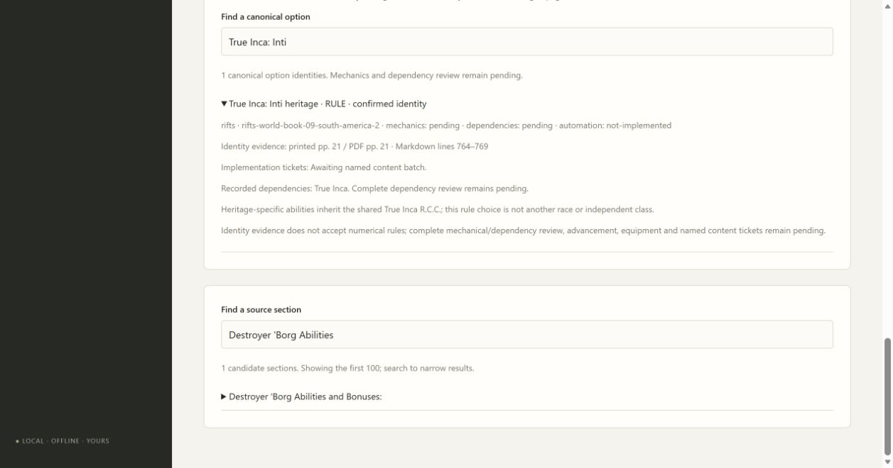

# 02B6 validation

Fifty-five Mercenaries, Merc Ops and South America 2 creation identities expand the catalog to 224, with 223 awaiting named content tickets. Identity evidence does not activate builder choices or certify mechanics. Named NPC examples are distinguished from new classes; unresolved racial profile references, occupation adaptations and edge variants remain findings.

Original South America 2 contents/quick-find pp. 4–6, True Inca pp. 20–21 and neighboring Destroyer pages 107/109 were visually inspected. Printed/PDF pages match; the damaged printed/PDF108 remains explicitly blocked and its affected candidate is linked. Mercenaries contents p. 4 and optional Lost Ones p. 49–50, Merc Ops contents p. 4 and Auto-G p. 48 establish the +2/+1 offsets and named templates. Four True Inca heritage rule identities inherit the shared racial class. Body evidence distinguishes Ojahee racial traits from its Trooper and cyborg occupations and equates Equinoid/Psi-Taur.

Thirteen focused coverage workflow checks and all 99 full checks pass (one frozen-package check reserved for Windows packaging), including mypy, compilation and browser JavaScript syntax. Edge verifies 224/223 counts, Psi-Taur alias search and the inherited Inti heritage link. Both independent review axes approve without actionable findings. Source fingerprints were compared to all 13 current corrected Markdown files and remain unchanged.

