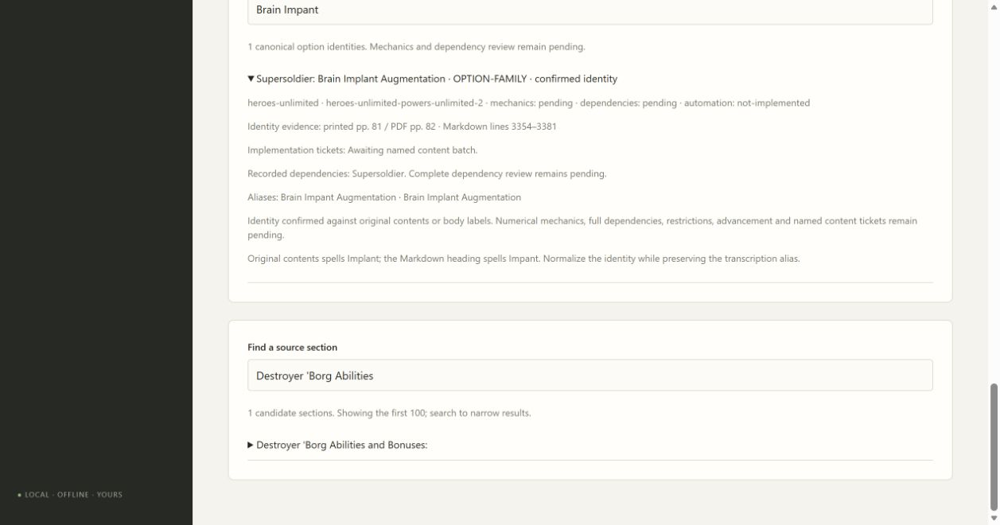

# 02B7 validation

Forty-seven Powers Unlimited 2 creation identities expand the partial catalog to 271 with 270 unassigned. Original contents pp. 4–5 verify category and branch labels and the printed-to-PDF +1 offset. Original Immortal table pp. 60–63 verifies sixteen named results: four on p. 60, three on p. 61, five on p. 62 and four on p. 63. They retain the shared Markdown table candidate without collapsing their identities. Original pp. 94–95 confirm Directed Force, Super Power Punch, Sidestep and Spit Spikes. Printed p. 96 supplies a Heroes character-sheet field reference for future export work.

Minor Hero is a modifier rule despite the quick-find category label. Original Implant spelling and Markdown Impant remain searchable; Golem paragraph ordering is flagged for mechanical reconciliation. Mega-Hero and core psionic/bionic/robotic dependencies stay within Heroes Unlimited. Supporting mechanical audit and named content-ticket fan-out remain pending; no numerical rules or builder activation are certified.

The new public workflow check first failed on missing Minor Hero, then passed after adding the records. All 100 checks pass (one frozen check reserved for Windows packaging), including mypy, compilation and browser JavaScript syntax. Edge verifies 271/270 counts and the Impant alias, source pages and Supersoldier dependency. Standards approves after stale count repairs. Spec approves after adding the Chemical Enhanced Hero alias and explicit Mega-Hero/Alien Appearance/psionic source dependencies. Final additive data/assertions were self-reviewed and passed all 14 focused checks and mypy; the Standards agent hit its thread limit before the last targeted round. No product-code changes.

