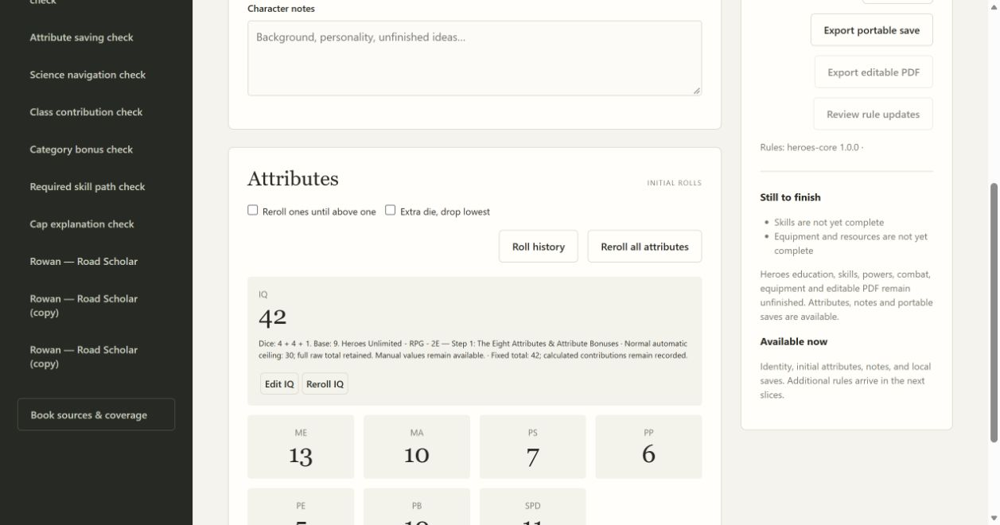

# 03 validation

The basic Heroes flow adds a separate Human-origin Mutant category with initial attributes, house rules, individual/whole rerolls, fixed/additive values, notes, local persistence, duplicate and exact portable definitions. Education, powers, category modifiers, resources, equipment, combat and editable Heroes PDF remain unfinished and visibly tracked; Rifts grants/calculations are not projected into Heroes.

Original Heroes Revised Second Edition printed p. 15 / PDF p. 16 was rendered and visually inspected. Eligible retained totals 16–18 receive a D6; another six repeats until non-six. This reviewed interpretation follows the uncapped wording and the user's request for each game's book method. The earlier optional question remains unanswered; no user approval is inferred. The existing 10,000-draw guard rejects a nonterminating source without saving partial attributes. Bonus dice do not reroll ones or participate in dropping the lowest. Portable replay now uses the exact pinned racial formula; all imported definitions must belong to the character's game.

Three initial workflow checks failed because the game argument was absent, then passed after implementation. They verify a four-bonus chain, combined house rules, retained fixed values, save/reopen/import, foreign-skill and foreign-pack rejection, and atomic failure. All 103 initial checks pass (one frozen-only skip). Edge verifies game selection, saved Heroes notes, reopen and switching back to Rifts grants. Independent review found a normal-mortal ceiling distinction; a new regression initially failed at 38 versus 30. Normal automatic IQ/ME/MA/PB stop at 30, PS at 40 and PP at 50 (original pp. 15–16), while full raw totals and dice remain. Fixed/additive manual edits are honored above those ceilings; god/alien/power exceptions remain explicit pending rules. All 104 final checks pass (one frozen check reserved for Windows packaging), including mypy, compilation and JavaScript syntax. Both review axes approve the cap repair. Standards notes only a nonblocking repeated-game-branch heuristic for future expansion. Browser fixed42 remains after reroll and reload, with fresh raw dice and explicit cap explanation; expanded cards were widened and visually inspected for readability.

