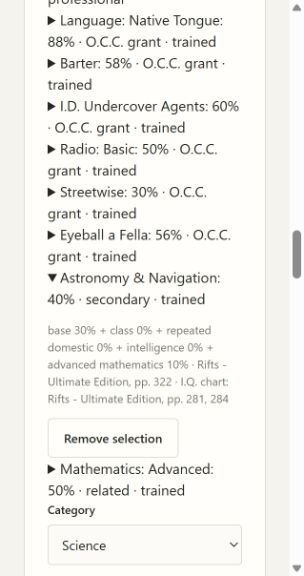

# 05B6 validation

Eleven source-reviewed Science choices bring the selectable catalog to 57 under skills 1.7.0. Earlier versions remain accepted and saved characters require an explicit preview/apply update.

Original Rifts Ultimate Edition pp. 321–323 were rendered and visually inspected for names, percentages, advancement rates, prerequisite wording and synergies. Printed p. 300 permits only Astronomy & Navigation and Basic/Advanced Mathematics as secondary Science choices. Vagabond related choices remain Mathematics only. Honor-system retained choices keep their counts and do not acquire an unavailable class bonus.

`scripts/check.ps1` passes all 84 tests, mypy (30 files), Python compilation and all browser JavaScript syntax checks. The five new CharacterApplication workflow checks cover Navigation, Archaeology's two percentages, History/Computer synergies, prerequisites, invalid-pool retention, portable saves and explicit version updates. Existing active-version assertions were updated to 1.7.0 and 57 definitions; prior pinned values remain unchanged.

Browser verification: selecting secondary Astronomy & Navigation first shows 30% and missing prerequisite guidance. Selecting related Advanced Mathematics changes navigation to 40%, with base 30 + class 0 + Advanced Mathematics 10 separately explained. Both independent Standards and Spec reviews approve without actionable findings.

Zoology's conditional specialization, Lore and Computer Hacking target definitions, alien-species medical contexts and acquired-level advancement remain pending. This slice does not claim full Science automation or full skill-path completion.
