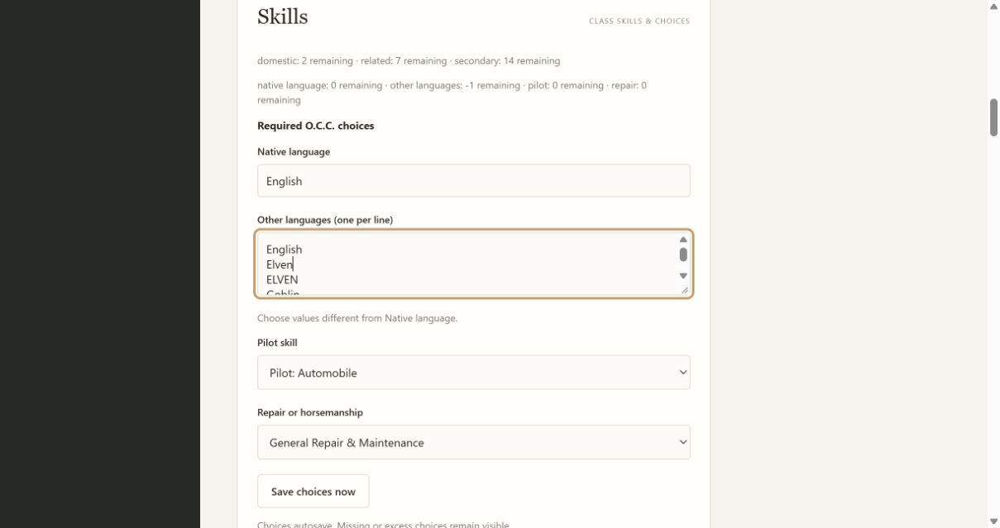
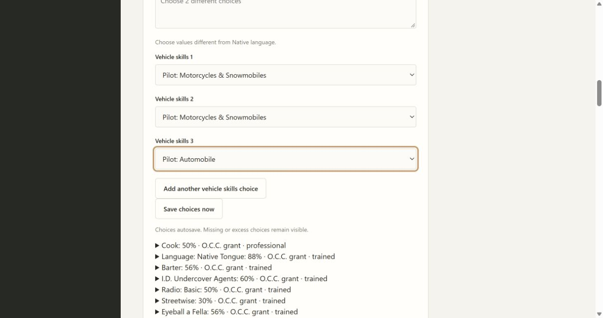

# 05C1 validation

Base32539cc. Contract: [required percentile groups](../required-skill-groups-contract.md). City Rat is preparation only; it is not activated or mechanically complete.

Two public workflow tracers failed before implementation: new multi-select group rejected as an unknown required key, and old pinned catalog missing the shared group interface. Both pass after immutable skills2.8.0 and legacy adaptation. The fixture exercises two-choice groups, duplicates/excluded labels/excess, once-only proficiency grants, portable import and rejection without save changes. The old2.7.0 workflow verifies equivalent choices/percentages, read-only preview and explicit2.8.0 update without rolling.

Independent Standards and Spec reviews both identified the stale advancement validator's legacy-only required IDs. A third public tracer reproduced the failure; deriving IDs from the neutral group normalizer repairs it. Filled choices now advance to2, retain learned levels in portable import and undo without changed base values. Standards independently reran the repaired public advance/import path. Both review axes approve.

Final local full suite:222 tests pass, with one frozen-only skip. Focused23 progression/required/update checks, mypy77, compileall, all browser JavaScript syntax and diff whitespace pass.

Browser verified the existing level15 save with its old2.7.0 pin, native/other language edits, excluded and duplicate labels, excess unique languages, pilot/repair save and reopen, and a reviewed2.8.0 update with unchanged values. An isolated generic two-select fixture (not a newly activated source class) verified extra rows, duplicate retention, once-only projections, save and reopen. A newly added blank row initially disappeared during an in-flight autosave refresh; local row counts now survive same-character/same-schema refreshes and reset across characters/layouts. Retest verified the empty third row survives and its selection persists after reopen. Standards reviewed this final repair.

Required Windows full/frozen checks precede merge; frozen assertions fill all actual Vagabond groups, then exercise progression/import/PDF/restart. Full parent05 and other O.C.C. automation remain open.
