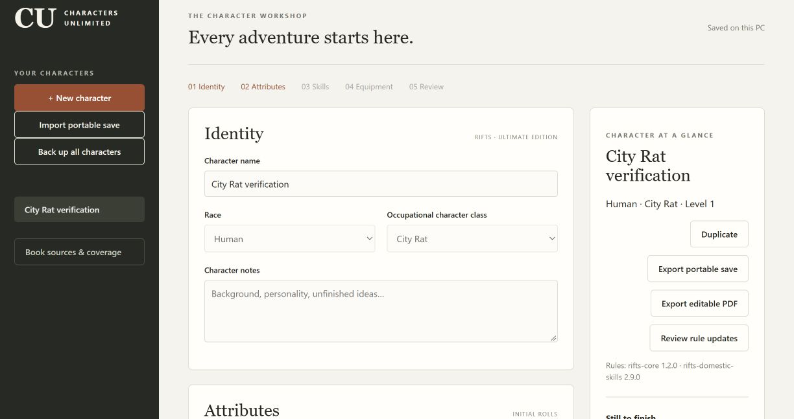
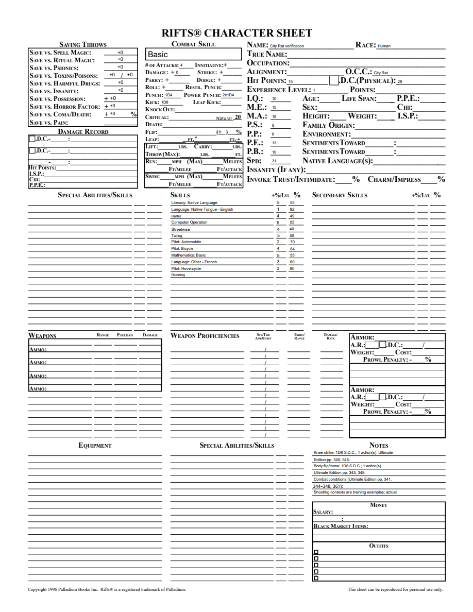

# 05C2 validation

Source: original Rifts Ultimate Edition PDF pages91–92 (printed88–89),321 (printed318) and324 (printed321), plus general HP/SDC and XP rules. Root visually inspected rendered original pages91/321/324; these copyrighted source renders stay in ignored tmp. Candidate IDs and exact source hashes remain in canonical inventory and immutable packs.

Public CharacterApplication tests initially rejected unavailable City Rat, then passed creation/resources, named choices, level-three progression/import/undo. A further public regression reproduced optional Barter54% inheriting a Vagabond ability; the resolved class now yields44% (base30, Related10, Math/Literacy4), with no inherited ability. Fixed O.C.C. Barter49% remains distinct. Automatic Running has a stable trained display and contributes once.

Both independent review axes approve. Standards found the automatic Running display lacked quality, causing undefined in the browser; root added trained and verified the final public projection. Spec independently checked level15 HP73 with constant fours, portable import, editable PDF class and undo14. Six initial full-suite failures were stale active-version expectations, repaired to core1.2/skills2.9; all33 affected checks pass. Mypy80, compileall and browser syntax pass. Final full suite and Windows frozen checks follow before merge.

Browser created Human City Rat with class-specific 10/8 pools, +3 Perception and one W.P. slot. English/French/Hovercycle choices autosaved with zero remaining, Knife filled the single slot, starting HP15/SDC29 generated from real rolls, and reopen retained them. Restarted runtime verified Running trained and correct City Rat source pages.

PDF inspection: three-page editable export retains native artwork, class/identity/attributes/required skills and physical Running row. Editing NAME to Edited City Rat persists on reopen/render. Unknown low-P.P. combat totals remain blank per existing documented gap.

Full mechanical City Rat review and parent tickets stay open. This evidence is not the final project retrospective.

Final local full suite:227 tests pass, one frozen-only skip. Affected33, mypy80, compileall, browser syntax and source-coverage/audit checks pass. Windows full/frozen CI precedes merge.

Merged PR #59 as3fcd2c5 after Windows full/frozen checks37166246403 and37166240913 passed.
