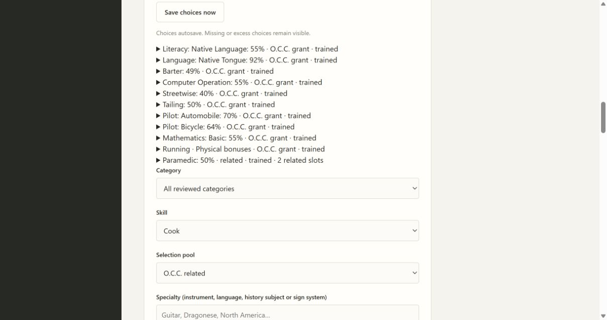
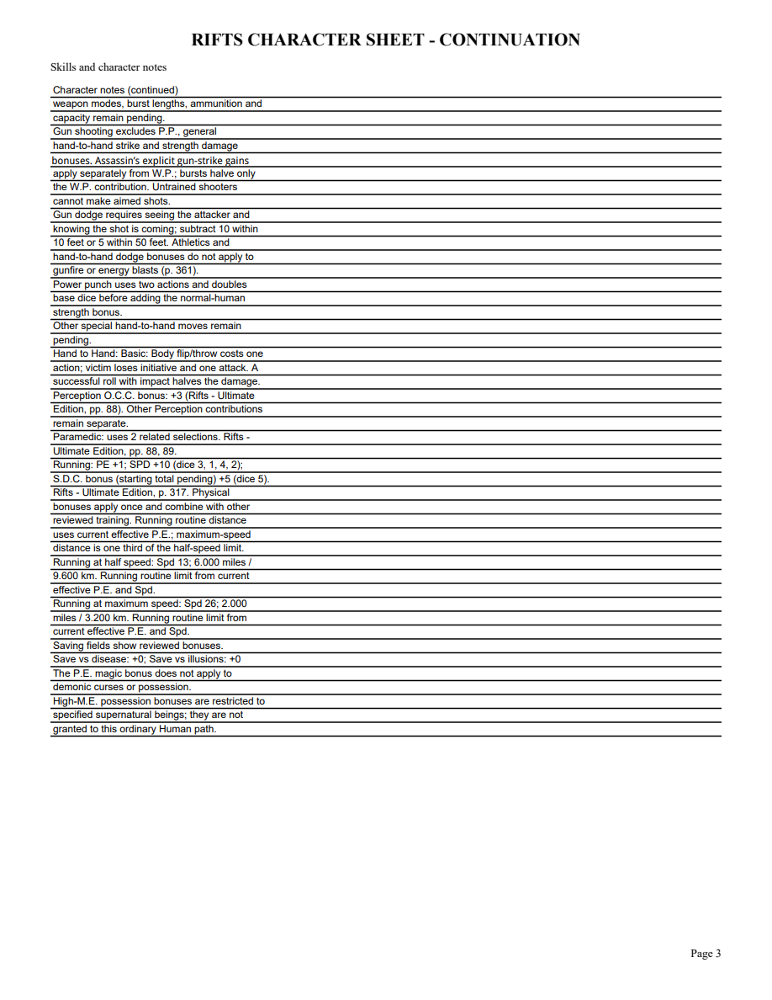
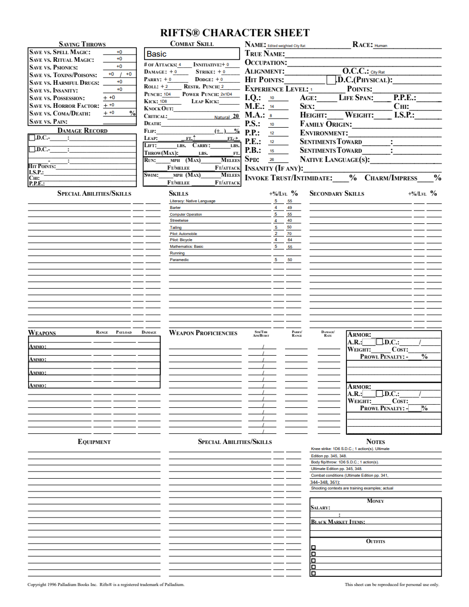

# 05C3 validation

Source: Rifts Ultimate Edition printed p.88/PDF91 explicitly makes City Rat Paramedic cost two Related selections. The original source render was visually checked during05C2; new skills2.10 changes only this class cost, version and the completed gap note.

Red public tracer: selecting Paramedic left Related9, expected8. Green: Related8/Secondary8, Paramedic50%; advancement to3 leaves9/9 and60%, with unchanged acquired-level growth and successful portable/PDF export. A second public tracer checks an old2.9 save stays9 until reviewed preview9→8/apply, without any dice or resource/attribute changes. Six retained duplicate selections consume12slots, leave−2 and retain six50% rows without multiplying bonuses.

Both independent Standards and Spec reviews approve. Spec additionally exercised a level-three old-pin update, portable import and undo through2to1, preserving historical2.9 accounting and exact source closure. Focused22 tests, mypy81, compileall and browser syntax pass. Full suite and Windows frozen checks precede merge.

Browser: created City Rat, selected Paramedic, saw50% and2Relatedslots with remaining8/8; reopen retained the selection. Expanded final explanation cites pp.88–89 separately from proficiency sourcep.314. The native editable PDF includes Paramedic50% and continuation cost/source; NAME edited to Edited weighted City Rat persists on reopen/render.

Physical/Rogue minimum is separate, pending user interpretation. Full City Rat review and parent05 remain open. No final retrospective or full-scope completion is claimed.

Final local full suite:229 tests pass, one frozen-only skip. Mypy81, compileall, browser syntax and diff whitespace pass.
