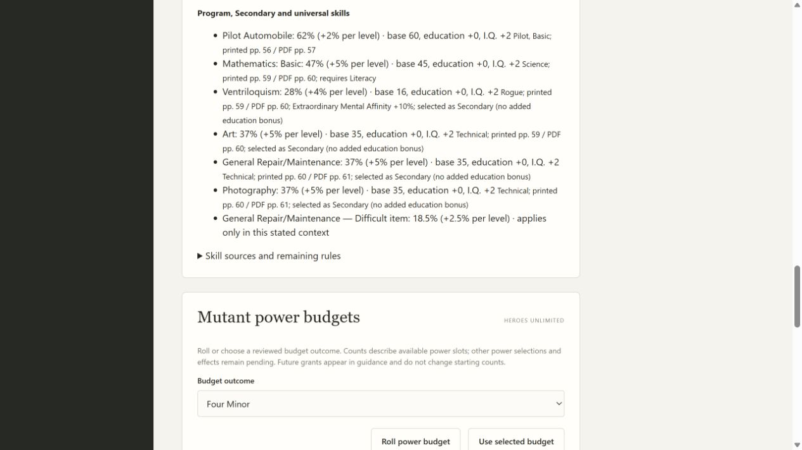
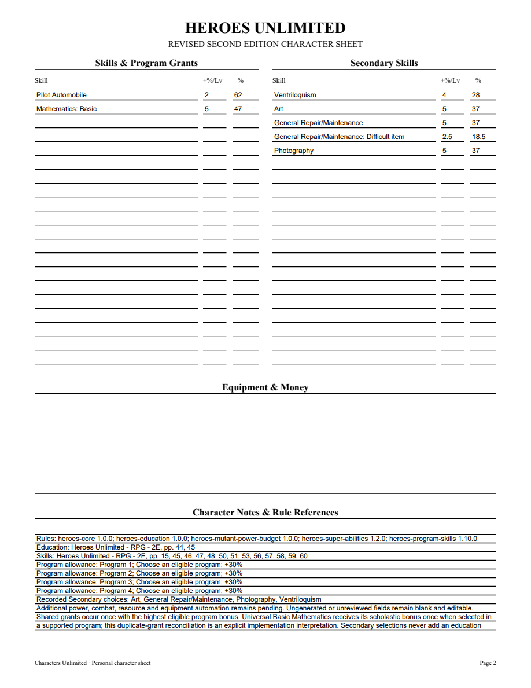
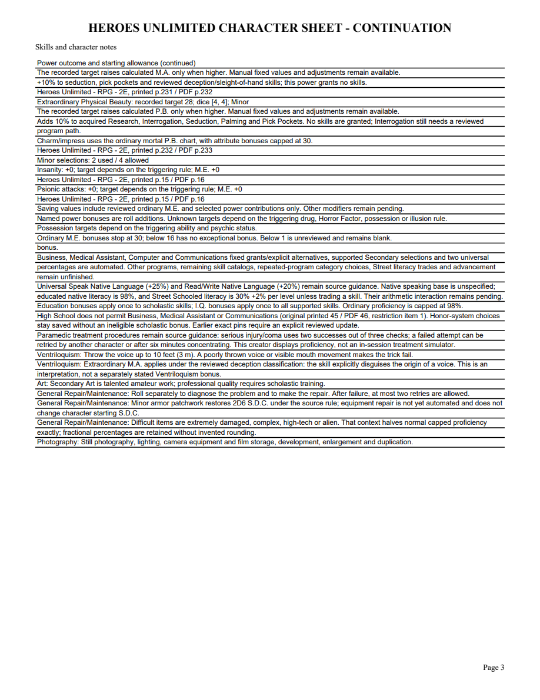
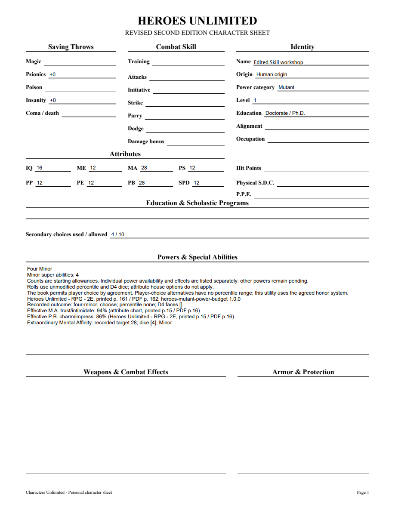

# 06I validation

Ventriloquism, Art, Photography and General Repair/Maintenance were verified against corrected Markdown and original HU PDF pages60–61 (printed59–60). All four are eligible one-choice Secondaries under their own categories. Ventriloquism uses the documented deception interpretation for Extraordinary M.A.; no P.B. or other inferred skill contributions apply.

The first public application tracer rejected the unavailable choices, then passed after the immutable1.10 pack was added. Three new tests cover bases/growth, no education bonus, exact fractional Repair context, reversible acquired power bonuses, exact legacy pins and explicit update, portable reopening and editablePDF values. The first full run found two existing synthetic future-version fixtures colliding with the new real1.10; those fixtures now use99.0.0. PDF inspection found a clipped context name; it now reads Difficult item with full conditions retained in notes. A temporary repair script failed to decode the UTF-8 pack; it was corrected before the final full run and canonical hash was verified.

Focused12 tests pass. Repository-required mypy --check-untyped-defs passes97 files; compilation, browser-script syntax and whitespace checks pass. Both independent review axes approve, including the focused fixture/label follow-up. Final full suite passes280 tests in170.544 seconds, with one frozen-only skip. Windows checks are pending.

Browser selection through Technical/Rogue shows four selections used. At I.Q.16, Art/Photography/Repair37 and difficult Repair18.5; Ventriloquism28 includes M.A.+10 once. Reload/reopening retains values. The three-page editablePDF matches those values and growth rates, including Repaircontext18.5/+2.5. Each original page and an individually edited NAME field were rendered with forms initialized and inspected after save/reopen. The shortened context fits; complete conditions appear in continuation notes. No Adobe viewer compatibility claim is made.

[Editable sample](06i-skills-sample.pdf)

Complete programs/catalogs, languages/literacy, training, armor repair, Heroes advancement and full corpus acceptance remain open. Parent06/09 remain open.

06I merged in PR73 as c9fa7185ca605bb69e25f2f562d0a2e4685d4dd3 after Windows37184169547(6m15s)/37184175254(6m20s) passed, including packaged executable validation.
