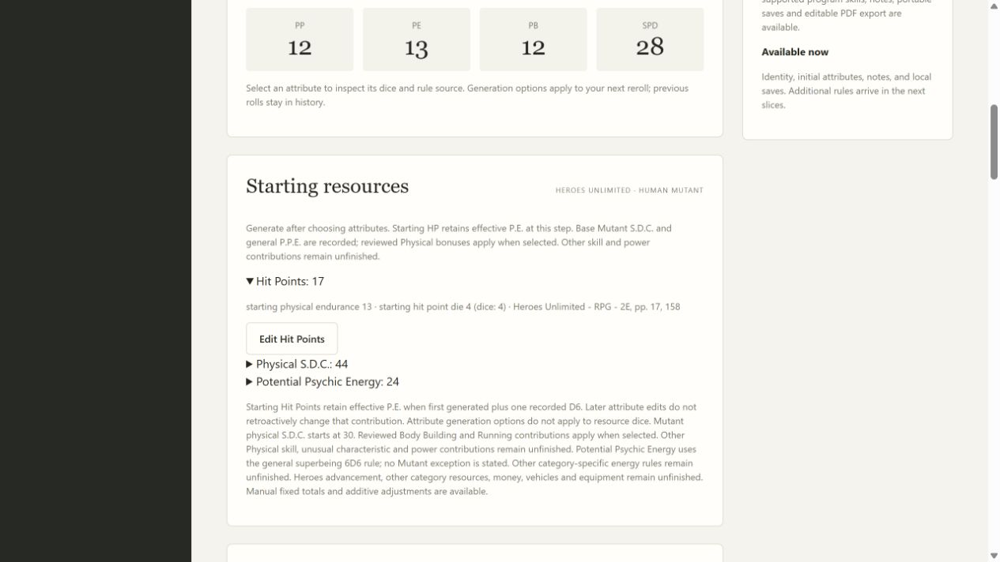
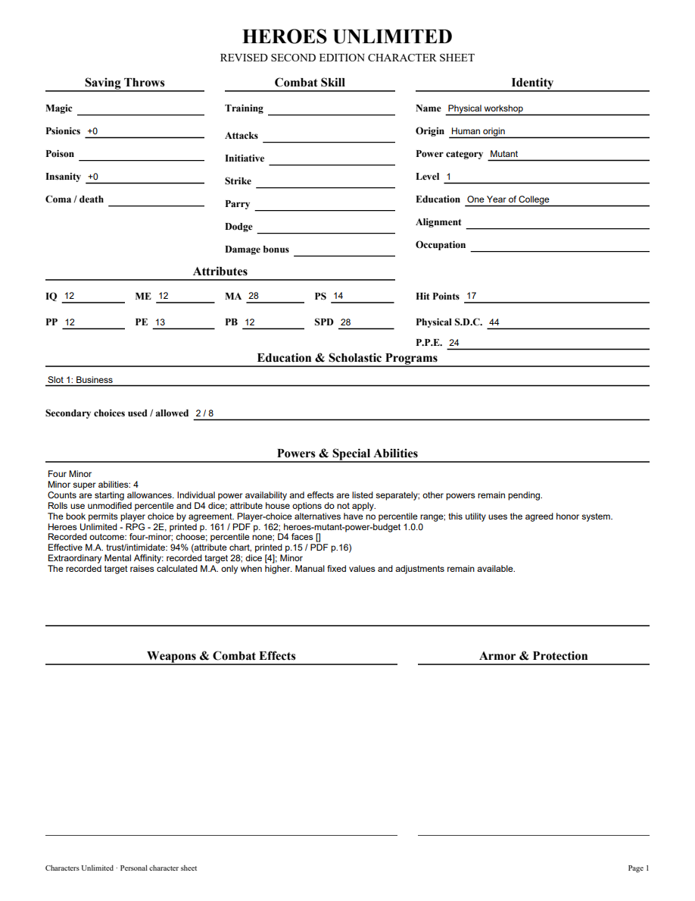
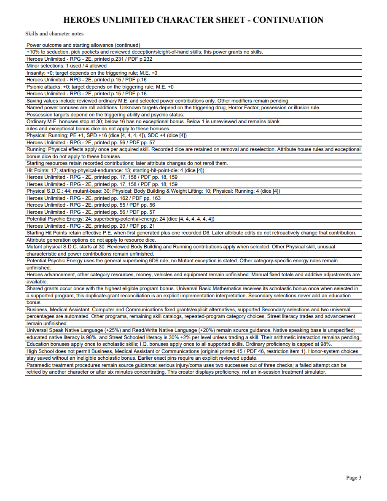
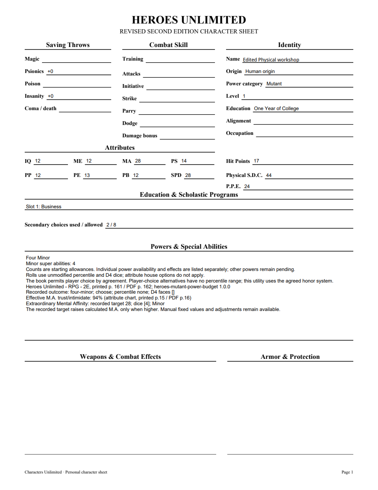

# 06J validation

Body Building & Weight Lifting and Running were checked against corrected Markdown and original Heroes Unlimited PDF pages56–57 (printed55–56). Body Building adds P.S.+2/S.D.C.+10; Running adds P.E.+1/Spd.+4D4/S.D.C.+1D6. Both are eligible one-choice Physical Secondaries. Effects apply once; bonus dice ignore attribute house options and exceptional rules.

Public application tracers first rejected unavailable choices, portable Physical receipts and missing PDF effect notes, then passed after implementation. Ten new tests cover duplicate choices, removal/reselection, initial effective P.E. snapshot, raw dice, manual fixed/adjusted values, atomic stale/invalid requests, exact pins, inactive/history/snapshot tampering, compatible updates, HTTP and editable PDF. An outside-group Computer program choice remains saved with a warning without acquiring Running. Acquired Heroes Physical definitions, including inactive names/guidance/prerequisites, cannot change through a compatible update.

The first full run found two regressions from broadening the shared Rifts upgrade guard: established Swimming/Running activity corrections must remain reviewable. The repair preserves that original Rifts contract and requires full acquired-definition immutability only for Heroes. Fifteen focused tests pass after repair. Both independent review axes approve, including this follow-up. Repository-required mypy --check-untyped-defs passes99 files; compilation, browser-script syntax and whitespace checks pass. Final full suite passes290 tests in186.492 seconds, with one frozen-only skip. Windows checks are pending.

Browser selection gives P.S.14/P.E.13/Spd.28 and HP17/S.D.C.44/P.P.E.24 with raw dice4. Removing Running gives P.E.12/Spd.12/S.D.C.40, retaining HP17. Reselection restores the same recorded dice and totals. Restart and reopening preserve selections and receipts. The three-page editable PDF matches the attributes/resources and includes separate Physical effects/dice/source notes without a Running percentage field. All original pages plus an individually edited NAME widget were rendered with forms initialized, saved/reopened and visually inspected. No Adobe viewer compatibility claim is made.

[Editable sample](06j-skills-sample.pdf)

Complete Physical catalogs, combat training, Heroes advancement, other powers/category construction and full corpus acceptance remain open. Parent06/07/09 remain open. Extraordinary Physical Endurance timing is separately confirmed: one retained D4 for every attained level including1; its implementation is a later slice.

06J merged in PR74 as a978688502364058f08f8063cbd4785856f561f7 after Windows37185966456(6m24s)/37185962664(7m36s) passed, including packaged executable validation.
