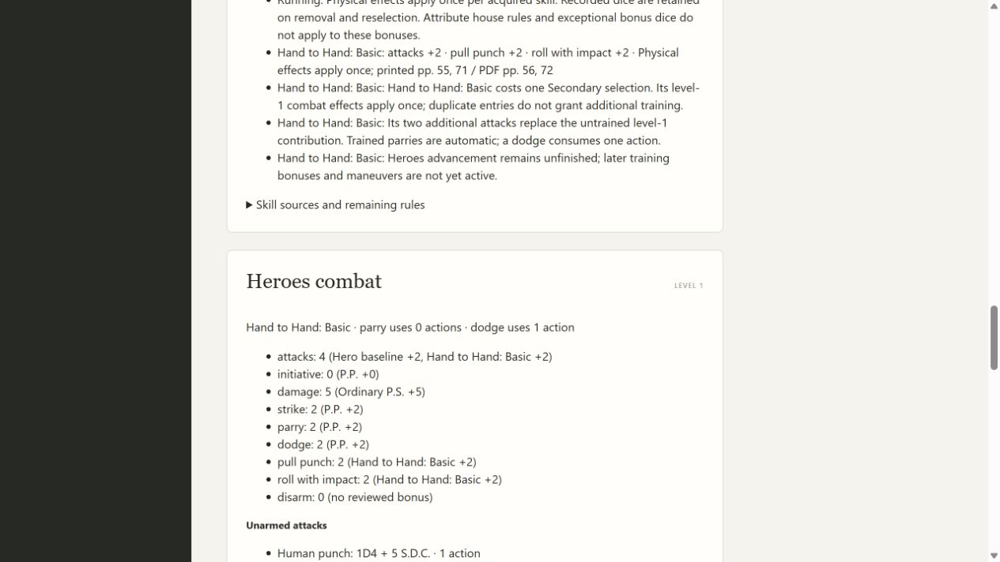
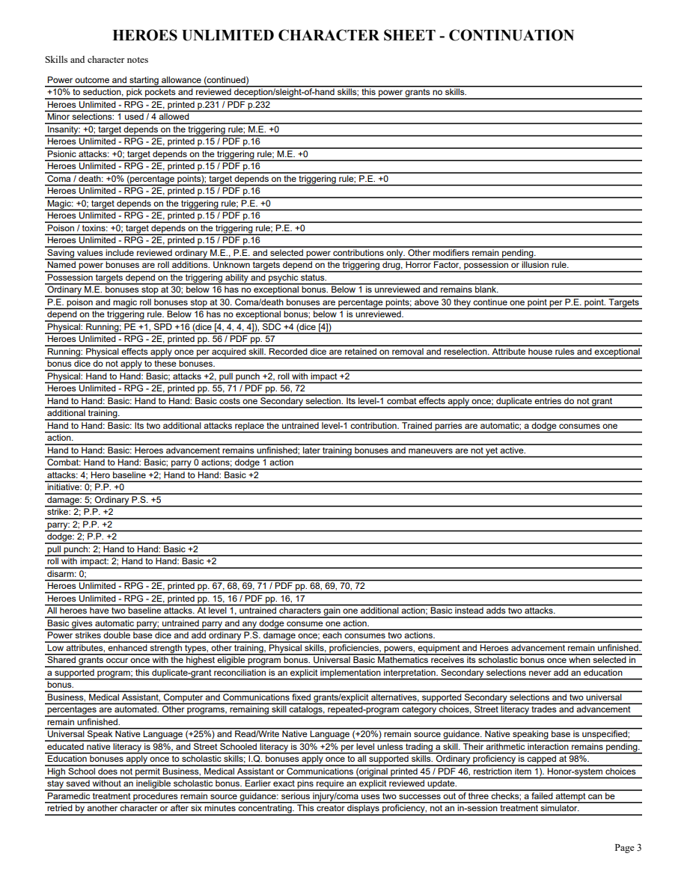
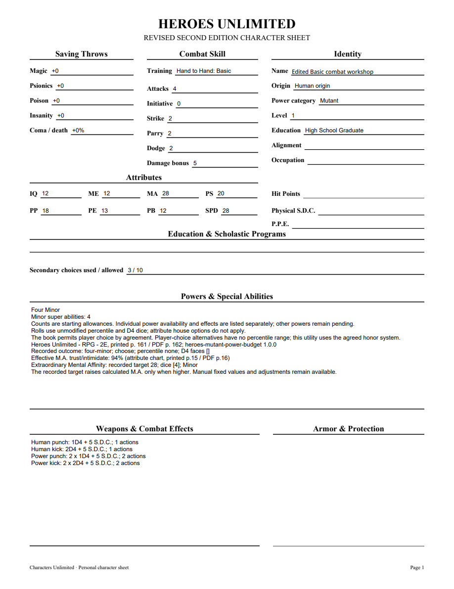

# 06K validation

Heroes Basic combat was checked against original printed55/PDF56 (training costs and once-only Physical effects), printed67-69/PDF68-70 (Human punch/kick, power strikes, action costs, untrained attacks) and printed71/PDF72 (two baseline attacks and Basic table). Ordinary P.P./P.S. use printed15-16/PDF16-17. Immutable skills1.12 adds Basic while preserving earlier acquired Physical definitions. Current Heroes characters support level1 only; later Basic progression is declared but not applied.

Application and PDF tracers initially lacked combat projection/filled training fields; they pass after implementation. A legacy update tracer initially omitted the new combat difference and now discloses None to 3 attacks. Five new public workflow tests cover Basic replacing untrained bonuses, duplicate selection cost with once-only effects, removal, action costs and unarmed expressions, ordinary attribute chart limits without Rifts rules, unsupported attribute contributions, invalid program-group grants, tampered empty acquisitions, inactive-definition update protection, exact legacy pins, portable receipts and editable PDF. HTTP verifies training projection, stale-revision protection and exported attacks. Frozen assertions exercise Basic alongside Physical skills and retained powers/resources.

Both independent review axes approve after repairs: out-of-range P.P. no longer hides independent Basic roll/pull bonuses, and unsupported P.P./P.S. contributions are absent rather than displayed as calculated numbers. Focused Basic5 and HTTP7 pass. Required mypy --check-untyped-defs passes102 source files; compile, browser-script syntax and whitespace checks pass. Final full suite passes303 tests in207.959 seconds, with one frozen-only skip. Windows checks pending. The first full run found two outdated blank-combat/empty-preview expectations; corrected focused PDF3/update3 tests pass before the final full run.

Browser selection and reload retain Basic training, four attacks, automatic parry, strike/parry/dodge+2 at P.P.18, damage+5 at P.S.20, and roll/pull+2. All three editable PDF pages were rendered with forms initialized and inspected; training, combat fields, normal/power damage and continuation references fit. An individual NAME widget was edited, saved, reopened and rendered successfully. No Adobe viewer compatibility claim is made.

[Editable sample](06k-basic-combat-sample.pdf)

Remaining training, Physical skills, proficiencies, enhanced strength, equipment, Heroes advancement and complete corpus acceptance remain open. Parent06/07/09 remain open.
