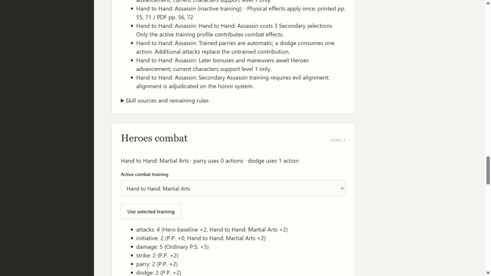
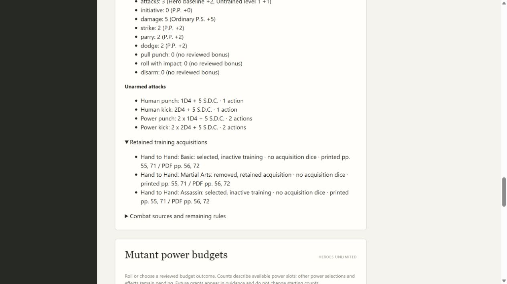
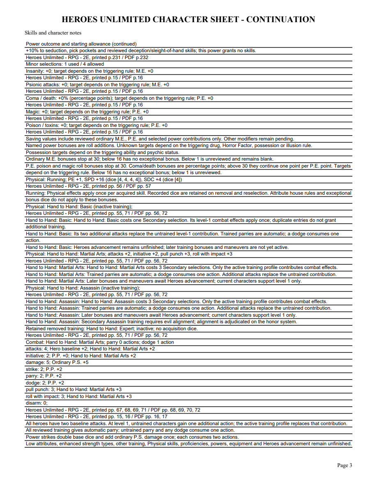

# 06L validation

Expert, Martial Arts and Assassin were checked against original Heroes printed71/PDF72 and training costs against printed55/PDF56. Secondary eligibility on printed47/PDF48 includes Assassin only for evil alignment; the utility shows this requirement on the honor system. Source locators use the checked-in Markdown SHA02927f54... and full table ranges3984-4042 beyond truncated heading candidates. Existing Basic definition is unchanged in new immutable skills1.13; its old acquired/inactive guard remains valid. Later progression is declared but remains inactive until Heroes advancement.

The public application tracer first rejected unavailable Expert. It now proves Expert4 attacks/roll2/pull2, Martial Arts4/init2/roll3/pull3 and Assassin3/init1/strike2/pull2, plus ordinary attribute contributions. Costs2/3/3 remain counted independently while one active profile contributes. Explicit no-training stays chosen. Multiple initial styles without an earlier active choice produce untrained combat and request a style choice. Removing an active style retains its choice and acquisition, contributes no bonuses, and restores that style on reselection. Invalid/unacquired/cross-game portable choices are rejected. Exact earlier Basic pins need a reviewed update; inactive acquired definitions cannot change.

Five new public tests cover profiles, costs, non-stacking, explicit none, removal/reselection/portable receipts, invalid mutations/imports, old pins and inactive-definition protection, editable PDF values and absence of later-level maneuvers. The HTTP suite verifies token/revision checks and style switching. Focused training5, Basic5 and HTTP7 pass; required mypy --check-untyped-defs passes104 files, compile and all browser scripts pass. Both independent review axes approve after a retained-source disclosure fix. Final full suite passes308 tests in206.243 seconds, with one frozen-only skip. Windows checks pending.

Browser example at P.S.20/P.P.18: Martial Arts4 attacks, initiative2, strike/parry/dodge2, damage5, roll/pull3. Removing Martial Arts shows untrained3 attacks and its removed acquisition/source. Reselection restores the same training. Adding/removing Expert preserves the active Martial Arts choice and retains the removed Expert receipt. Reload and a fresh application reopen preserve all choices. Every page of the four-page editable sample and an individually edited NAME widget were rendered with initialized forms and inspected after save/reopen. The full Martial Arts label fits, selected inactive Basic/Assassin and removed Expert source references are legible. No Adobe compatibility claim is made.

[Editable sample](06l-training-sample.pdf)

Other Physical skills, weapon proficiencies, enhanced strength, equipment, Heroes advancement and full corpus acceptance remain open. Parent06/07/09 remain open.
