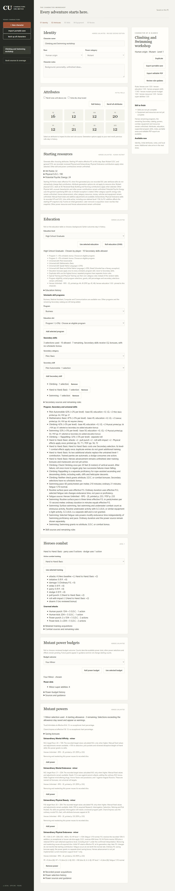
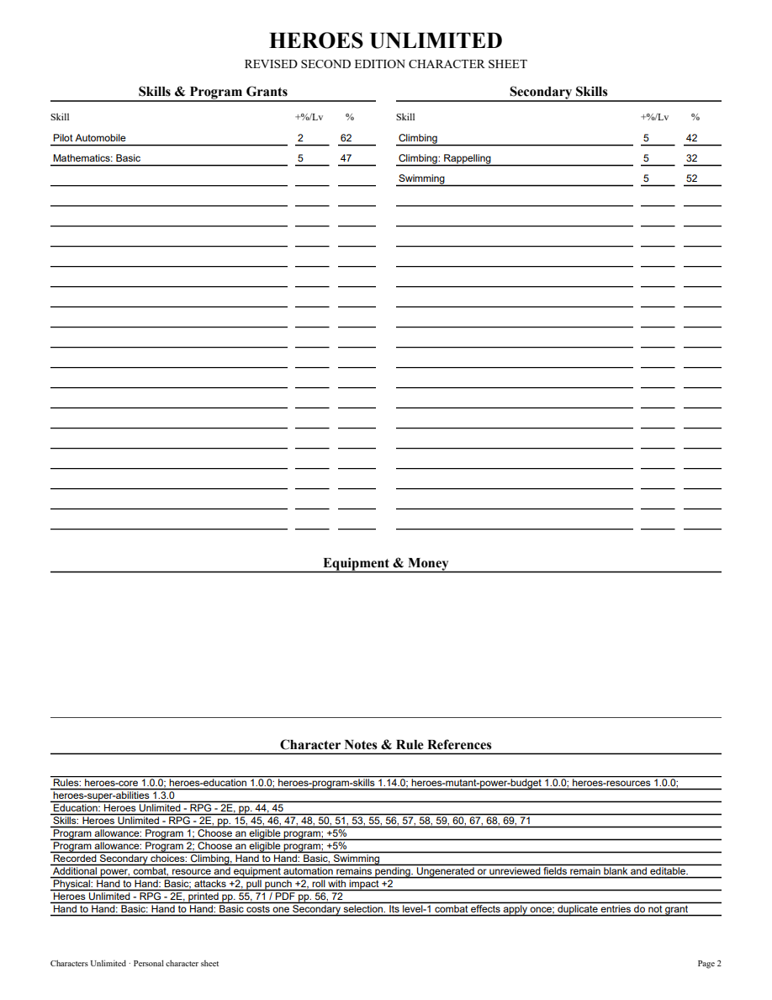
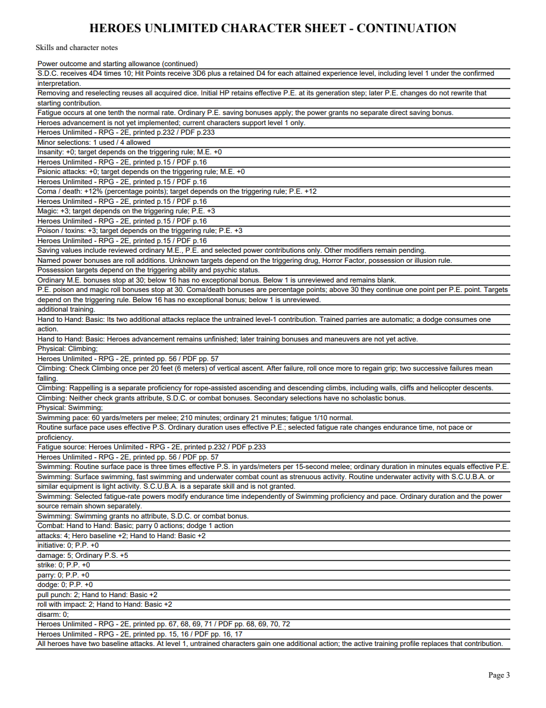
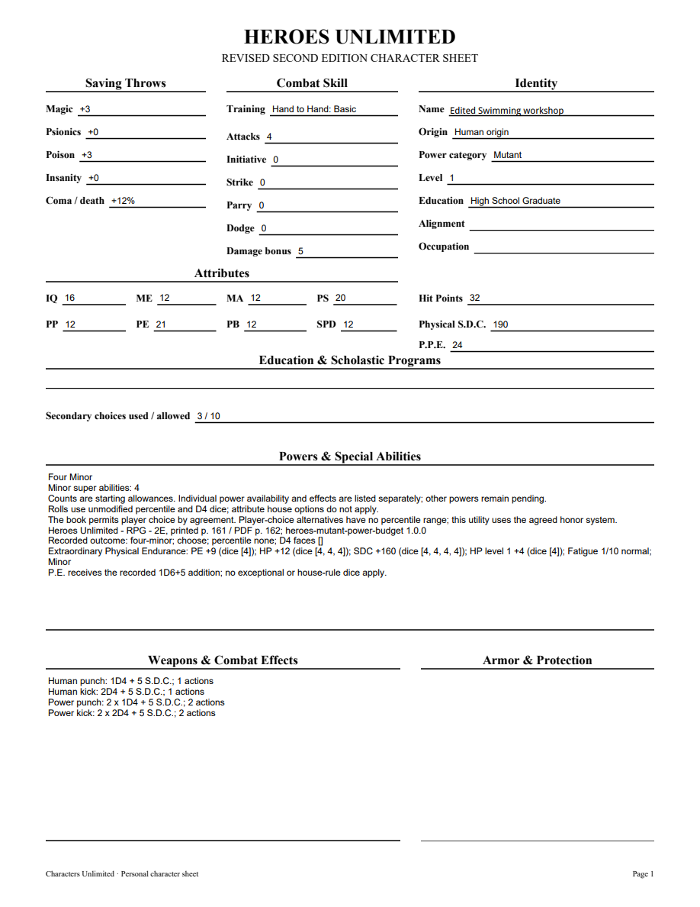

# 06M validation

Climbing/Rappelling and Swimming were checked against original Heroes printed56/PDF57 and the checked-in Markdown fingerprint. Climbing40+5 and Rappelling30+5 remain separate checks; Swimming50+5 has routine pace3 times effective P.S. per melee and ordinary minutes equal effective P.E. Secondary selections receive I.Q., with no scholastic bonus. Neither grants attribute, resource or combat bonuses.

The application tracer first rejected the unavailable selections. Six public tests now verify separate checks, empty retained Physical receipts, effective activity measures, independent unsupported-attribute guards, duplicate costs with once-only activity, power removal/reselection, initial HP snapshot preservation, portable receipts, exact legacy update and inactive full-definition protection. The PDF tracer first failed for missing pace; the export now includes separate editable checks and activity/source notes. HTTP token/revision checks include these selections; the frozen workflow exercises both skills and fatigue-adjusted time.

Both independent review axes approve after a safe-integer scaling repair. Supported endurance uses exact integer arithmetic; unsupported adjusted duration stays blank while ordinary duration, pace and source remain available. Required mypy --check-untyped-defs passes105 files; compile, all browser scripts and whitespace checks pass. Focused proficiency6/HTTP7 pass. Final full suite314 tests passes in192.842 seconds, with one frozen-only skip. Windows checks pending.

Browser sample: I.Q.16/P.S.20, Climbing42%, Rappelling32%, Swimming52%. Ordinary P.E.12 gives12 minutes and60 yards/meters per melee. Selecting Extraordinary Physical Endurance raises effective P.E.21 and gives210 minutes at1/10 fatigue, without changing pace/proficiency or recorded starting P.E.12. Power removal/reselection, Swimming removal/reselection and reload preserve receipts and calculated results. A fresh application reopen verifies the same values and HP32. All four editable PDF pages and an edited NAME widget were rendered with initialized forms and visually inspected after save/reopen. No Adobe compatibility claim is made.

[Editable sample](06m-proficiency-sample.pdf)

Other Physical skills, equipment, proficiencies, enhanced strength, Heroes advancement and complete source acceptance remain open. Parent06/07/09 remain open.
