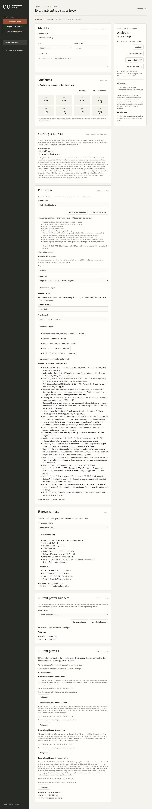
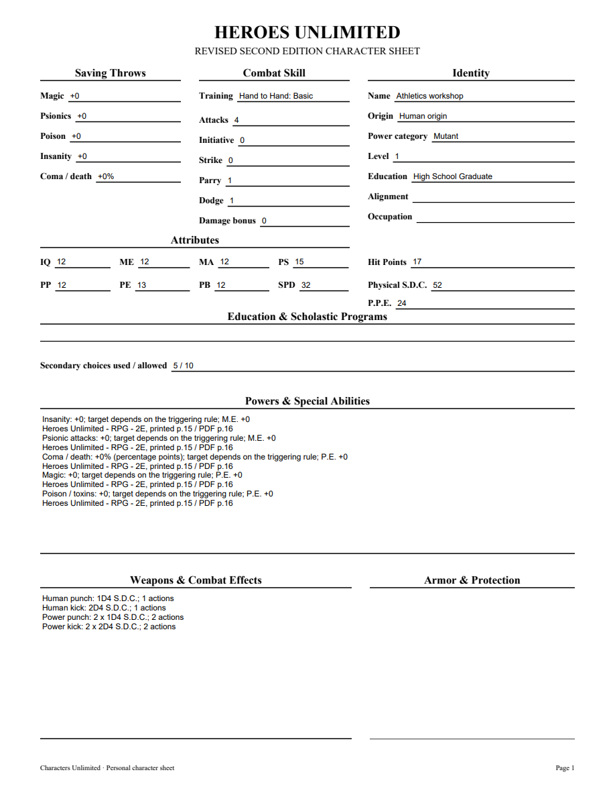
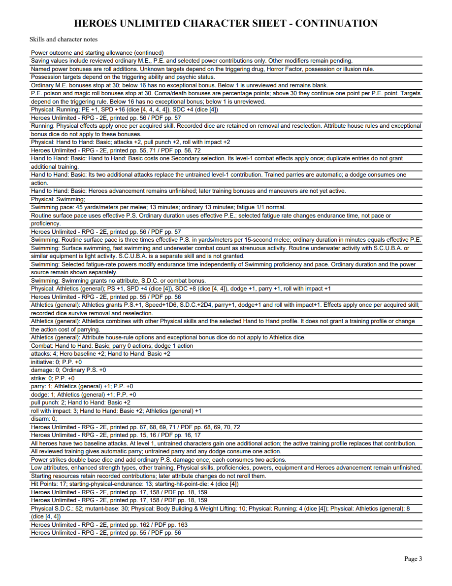

# 06N validation

Athletics (general) was checked visually against original Heroes printed55/PDF56 and checked Markdown3197–3205, SHA02927f54..., candidate4f6849fdab68a732d7c9. It costs one Physical Secondary choice, grants no percentile, and adds P.S.1, Speed1D6, S.D.C.2D4 and parry/dodge/roll-with-impact1. New immutable skills1.15 preserves all1.14 definitions.

The public tracer first rejected unavailable Athletics. Four application tests now verify duplicate costs/once-only effects, retained Speed/S.D.C. dice, combination with Basic and untrained combat, fixed attributes, Body Building/Running, HP snapshot preservation, portable tampering rejection, exact earlier pins, inactive-definition guards and editable PDF values/source. The legacy test exposed a comparison KeyError for percentile Physical rows without an effects projection; the comparator now expands only projected effects while retaining primary/additional percentile checks. Focused Athletics/proficiency/Swimming/HTTP20 pass. Required mypy --check-untyped-defs passes106 files; compile, all browser scripts and whitespace checks pass. Both independent reviews approve. Full suite318 tests passes in218.885 seconds, with one frozen-only skip; Windows checks pending.

Browser sample combines Athletics, Body Building, Running, Basic and Swimming: P.S.15, Speed32, P.E.13, S.D.C.52, HP17; Basic4 attacks, parry/dodge1, roll3. Removing Athletics changes Swimming pace45→42; reselection/reload restores45 using the same4/4/4 receipt. Fresh application reopen verifies retained dice and PDF fields. All four PDF pages and an edited NAME widget were rendered with initialized forms and visually inspected after save/reopen. Source and combat contributions fit and remain readable. No Adobe compatibility claim is made.

[Editable sample](06n-athletics-sample.pdf)

Other Physical skills, enhanced strength, equipment, Heroes advancement and full source acceptance remain open. Parent06/07/09 remain open.
