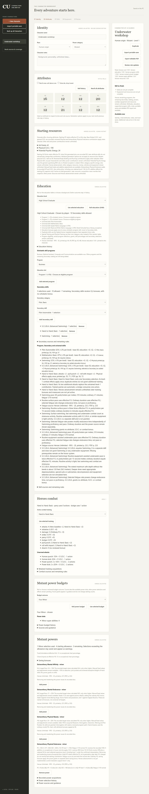
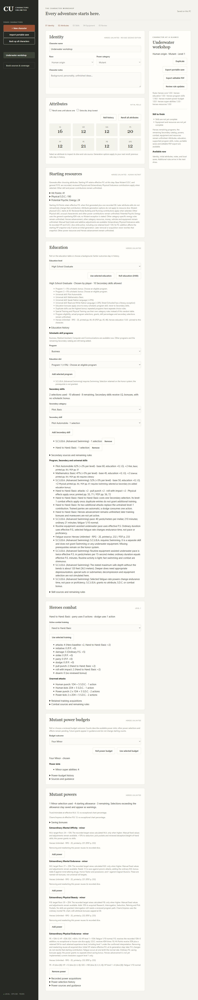
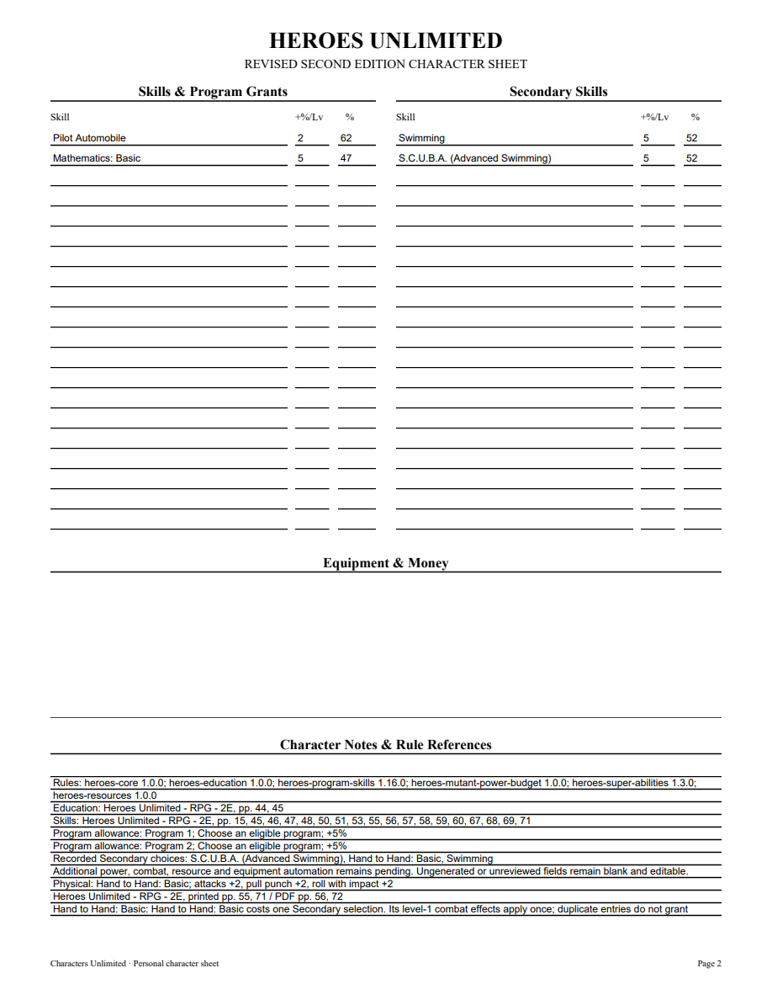
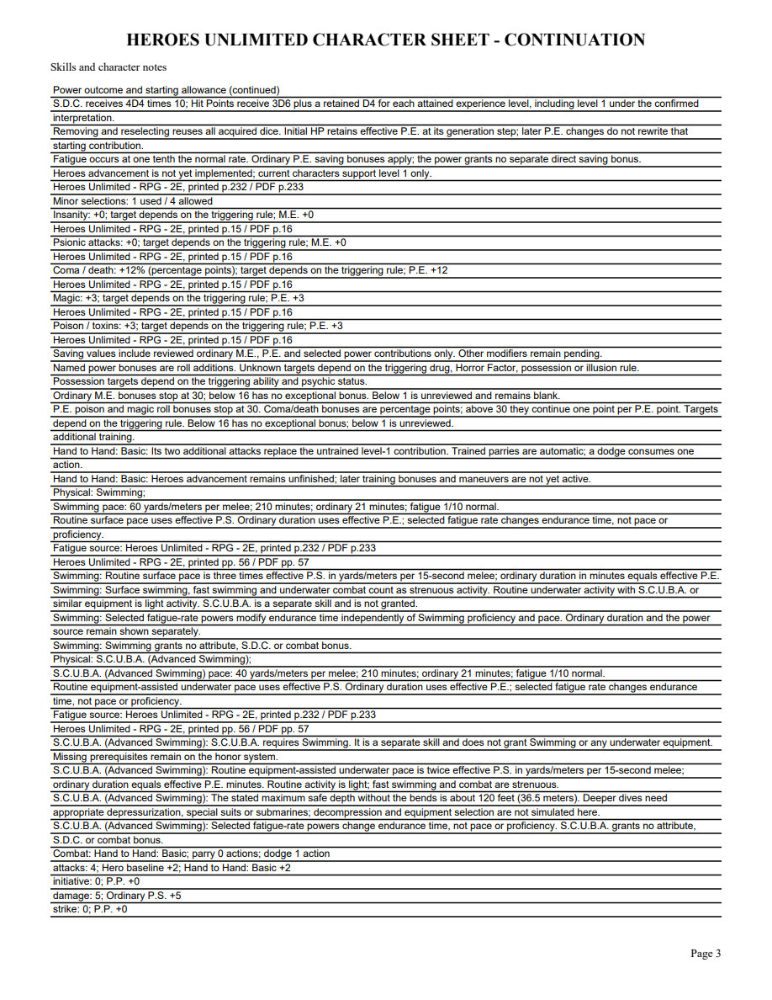

# 06O validation

S.C.U.B.A. was checked visually against original Heroes printed56/PDF57. Checked Markdown3244 shares a line with Gymnastics back-flip text; only the original S.C.U.B.A. paragraph is used (SHA02927f54..., candidate9e02bd07fb2418301a76). One Physical Secondary,50+5%, Swimming prerequisite,2P.S. yards/meters per melee and P.E. ordinary minutes.120feet/36.5meters safe-depth and light/strenuous activity guidance stay source-grounded. It grants no Swimming, equipment, attributes, resource or combat bonus.

The initial public tracer rejected unavailable S.C.U.B.A. Four public tests now verify distinct checks/activity identities, ordinary I.Q., source-declared pace, EPE time/source, once-only empty Physical receipt, duplicate costs, removed/outside-group prerequisites, retained resources/HP snapshots, portable tamper rejection, old exact pins, inactive-definition guards and editable PDF values/guidance. Missing Swimming is a warning with the choice retained under the honor system. Earlier1.15 definitions stay unchanged in immutable1.16. Focused21 pass; required mypy --check-untyped-defs passes107 files; compile, browser scripts and whitespace pass. Both independent reviews approve. Full suite322 tests passes in210.435 seconds with one frozen-only skip; Windows pending.

Browser sample: I.Q.16/P.S.20/P.E.21, Swimming52% and S.C.U.B.A.52%, surface60 and underwater40 yards/meters per melee,21 ordinary minutes and210 at EPE1/10. Removing Swimming shows the prerequisite warning and retains S.C.U.B.A.; restoring Swimming and reload retain both source-bound empty acquisitions. A fresh application reopen verifies results and HP41 (EPE active before initial resource generation). All four editable PDF pages and an edited NAME widget were rendered with initialized forms, saved/reopened and visually inspected. The full S.C.U.B.A. skill name fits; distinct pace and depth guidance remain readable. No Adobe compatibility claim is made.

[Editable sample](06o-scuba-sample.pdf)

Other aquatic races, equipment, Physical skills, Heroes advancement and full corpus acceptance remain open. Parent06/07/09 remain open.
