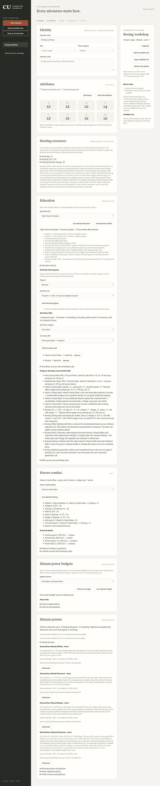
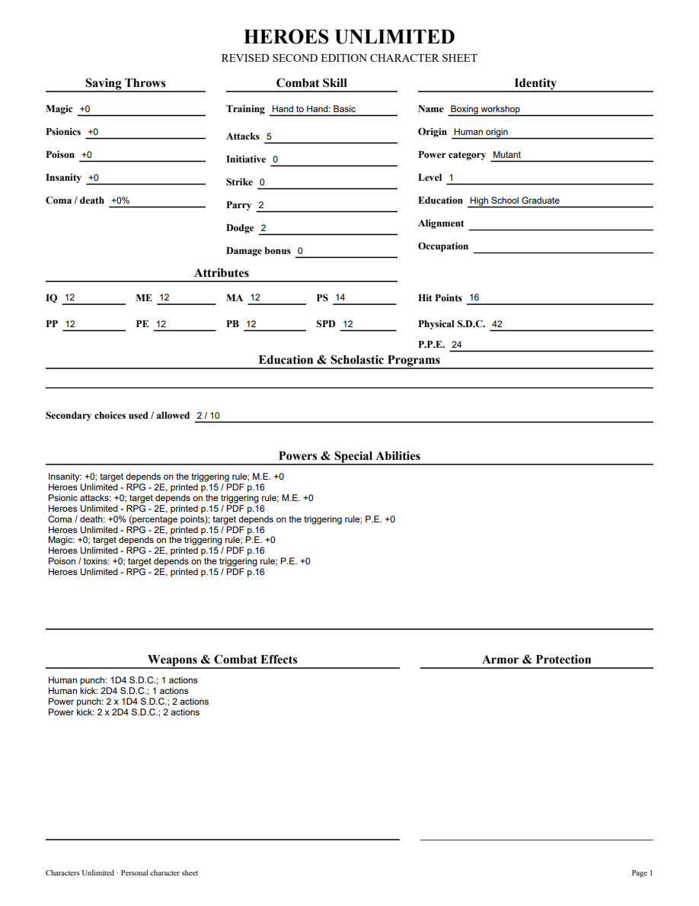
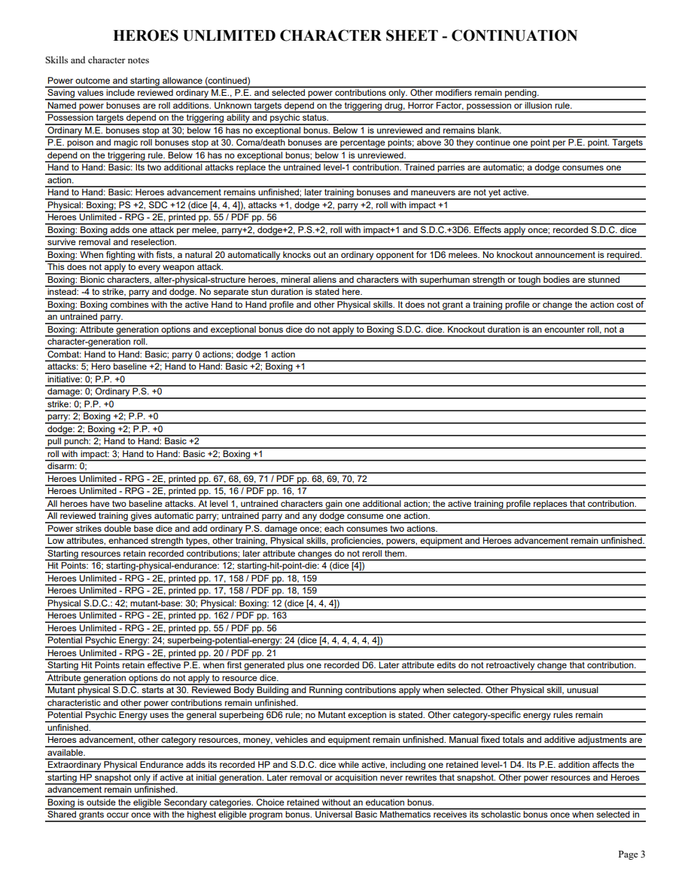

# 06P validation

Boxing was checked against original Heroes printed55/PDF56, checked Markdown3216–3224 (SHA02927f54..., candidate6e18f652aef50288a0cd). Once-only P.S.+2, S.D.C.3D6, attacks+1, parry/dodge+2 and roll+1 combine with the selected training profile. Natural20 fist knockout1D6 melees and resistant-target stun−4 guidance remain conditional, with no invented stun duration or universal weapon effect.

Standards review caught an eligibility conflict. Original printed47/PDF48 visually confirms Boxing is excluded from Secondary skills (Markdown2631). Corrected1.17 excludes it from eligible IDs but keeps the existing catalog/honor-system retention and outside-category warning. Its normal Physical program route remains pending. Earlier immutable definitions are unchanged. Both independent Standards and Spec reviews approve the correction.

Four public Boxing workflows verify once-only effects/duplicate counts, retained dice, fixed attributes, untrained parry action cost, portable tamper rejection, legacy pins/update and inactive-definition guards, combined editable PDF values, source/guidance and eligibility warnings. Focused20 pass. The initial HTTP PDF assertion still expected four attacks after Boxing was added; corrected to five. Final full suite327 tests passes in171.668seconds with one frozen-only skip. Required mypy --check-untyped-defs passes108 files; compile, browser script syntax and whitespace pass. Windows pending.

Browser sample: Basic plus Boxing gives five attacks, parry/dodge2, roll3, P.S.14, S.D.C.42 and HP16. Remove/reselect/reload retains4+4+4 S.D.C. dice and the outside-category warning. Reopened application verifies the same receipts. All four exported PDF pages and edited NAME appearance were rendered with initialized forms and visually checked. Canonical field/widget values agree; the edited NAME was saved and reopened with a nonempty appearance. No Adobe compatibility claim.

[Editable sample](06p-boxing-sample.pdf)

Physical programs, other skills/maneuvers, Heroes advancement, equipment and full corpus acceptance remain open. Parent06/07/09 remain open.

06P merged in PR81 as f3e484467afb02da9d72ed7448a71351913ee72d after Windows37196033706(4m14s)/37196035909(7m16s) passed, including packaged executable validation.
