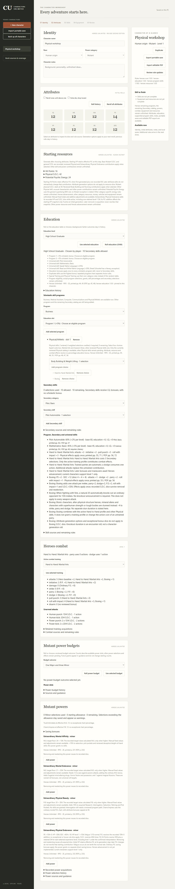
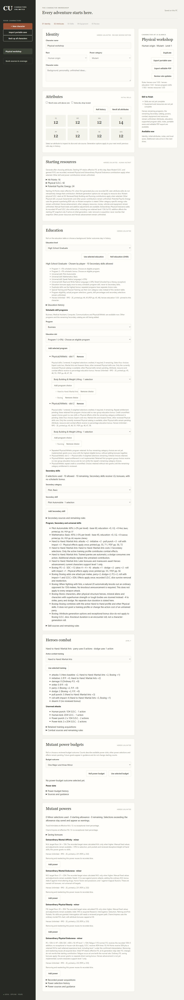
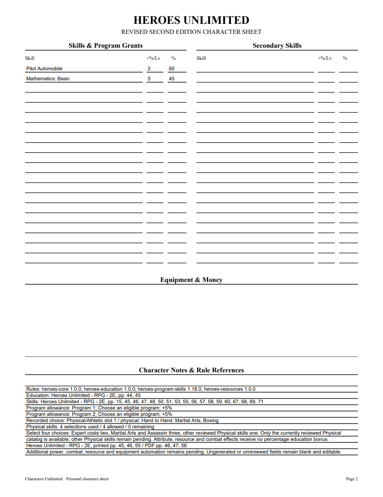
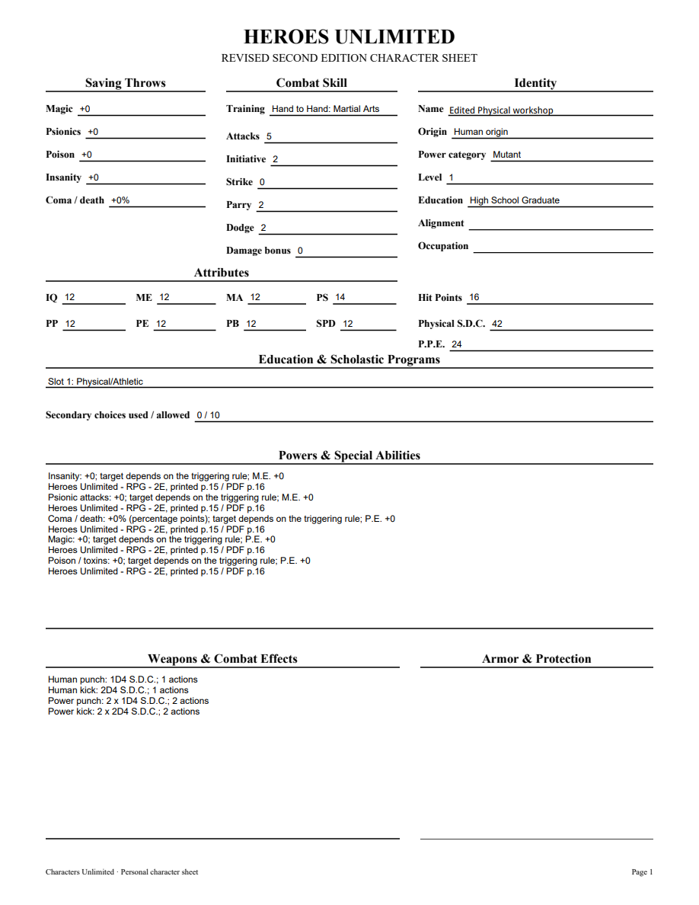

# 06Q validation

Physical/Athletic was checked visually against original Heroes printed46/PDF47 (Markdown2537–2540, candidate8be7be22d80be1e9e584). Original printed45/PDF46 restriction9 explicitly charges Expert2 and Martial Arts3 even in scholastic programs; printed55/PDF56 Physical introduction charges Assassin3 (candidateeb0c9091cada3ad67355). No fixed grants; four weighted choices from the reviewed Physical catalog, including Boxing. Boxing remains excluded from Secondary eligibility. High School offers two eligible slots; Military2/Military Specialist4 and other educated slots follow their declared restrictions; Street has none.

Six public program tests verify weighted/duplicate/outside/excess credit, ordinary I.Q./education percentages, once-only retained dice, independent resource/HP snapshots, fixed prior training preservation, explicit untrained choice, portable tamper rejection, exact old pins/update and inactive definition guards, editable PDF counts/costs/source and normal Boxing entitlement. HTTP verifies weighted counts and stale revision protection. Focused22 pass; final full suite334 tests passes in171.602seconds with one frozen-only skip. Required mypy --check-untyped-defs passes109 files; compile/browser syntax/whitespace pass. Windows pending. Initial public tracer rejected the unavailable program. A second tracer exposed lost active Basic training when adding another style; both program/Secondary mutations now share prior-profile preservation.

Both independent reviews approve after a repeated-program finding was repaired. A pending repeated Physical program retains entered choices but shows zero credit/credit_certified=false and no new skill/Physical grants. The first program remains intact; removing it promotes the remaining entry to normal first-program behavior. Existing groups/programs without the pending flag retain prior contracts. The interrupted pre-repair full run is not counted as final validation.

Browser: Boxing plus Martial Arts uses four weighted selections, no Secondary allowance, attacks5/initiative2/parry2/dodge2/roll4, P.S.14/S.D.C.42/HP16. Removal/reselection/reload retains Boxing4+4+4 dice. A repeated entry with Running is visibly uncertified and acquires no Running receipt/bonus. Its PDF field values also show zero credit/pending disclosure without new effects. After removing the repeat, the saved normal program has no warnings. All four final PDF pages and edited NAME were rendered with initialized forms and visually checked; reopened canonical fields agree with widget values, and the edited identity has its expected value/nonempty appearance. No Adobe compatibility claim.

[Editable sample](06q-physical-program-sample.pdf)

Other Physical skills/maneuvers, repeated-program remaining-category entitlements, Physical Training, Heroes advancement, equipment and full corpus remain open. Parent06/07/09 remain open.
