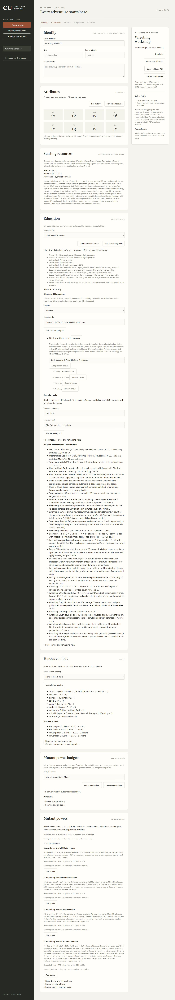
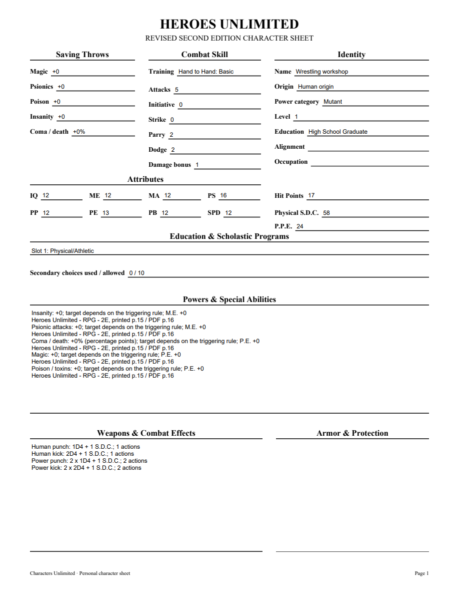
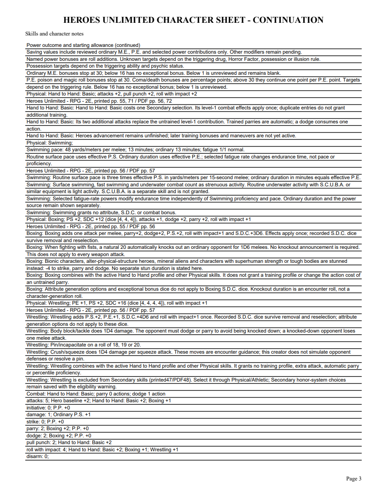
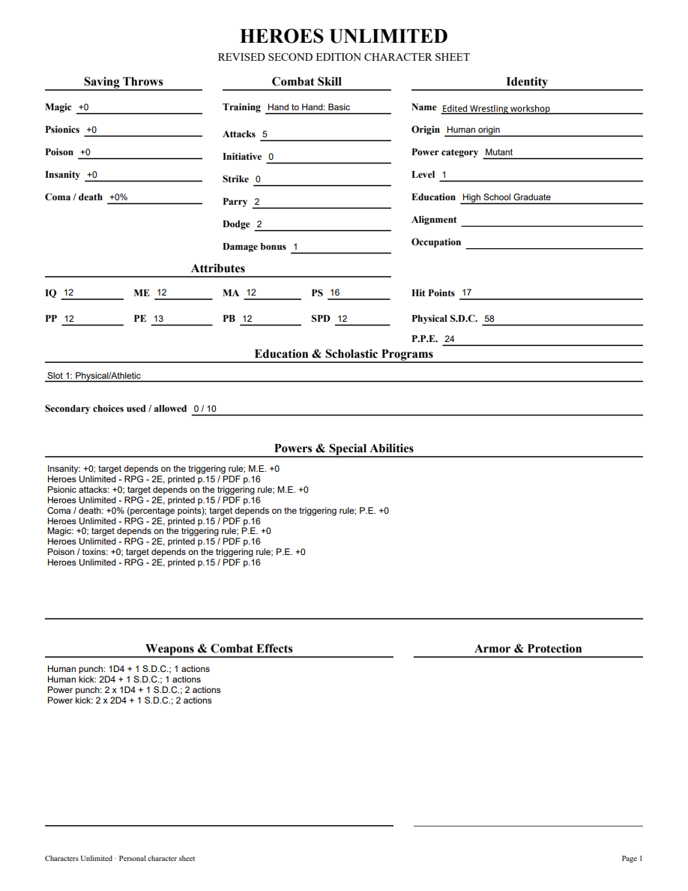

# 06R validation

Wrestling was checked against original Heroes printed56/PDF57. The checked Markdown fingerprint is02927f54f7ebfc544629092464cb7c3430daa84683ced4ebf8a3e0607af77282; use introduction3246 and actual moves/bonuses3280–3292, candidates9e02bd07fb2418301a76/39537a5bf6651d011cb8. Interleaved3250–3262 belongs to Gymnastics. Wrestling adds P.S.+2, P.E.+1, S.D.C.+4D6 and roll with impact+1; no invented P.P./percentile/training bonus. The original Secondary exclusion remains honored with catalog retention and a warning; Physical/Athletic offers the normal one-choice route.

Five public Wrestling tests verify normal combined training, removal/reselection, retained dice and starting HP snapshot, portable rejection, fixed attributes, untrained parry, duplicate honor choices, explicit1.18 upgrade, inactive source binding, pending-repeat no-grant behavior and editable PDF conditional moves/source. The initial public tracer rejected the unavailable skill; the same tracer passes under immutable1.19. Affected23 tests pass in14.392seconds; full339 tests pass in188.973seconds with one frozen-only skip. Required mypy --check-untyped-defs passes110 files; compile/browser syntax/whitespace checks pass. Both independent review axes approve with zero findings. Windows pending.

The existing packaged Athlete fixture now selects Wrestling, Boxing, Basic and Swimming, verifies the four-die receipt/roll contribution/move text and retains exact save/projection reopen checks. No fixture-count change.

Browser removal reduces credit to3 and Swimming pace/duration to42/12; reselection and reload retain four Wrestling dice of4. Normal combined totals: P.S.16/P.E.13/P.P.12, attacks5/damage1/parry2/dodge2/roll4, Swimming55% with48 yards/meters per melee and13 ordinary minutes, S.D.C.58/HP17. All four PDF pages and edited NAME were rendered with initialized forms and visually inspected. Reopened canonical field values agree with widgets; edited NAME has its expected value and nonempty appearance. No Adobe compatibility claim.

[Editable sample](06r-wrestling-sample.pdf)

Acrobatics/Gymnastics, other maneuvers, Heroes advancement, equipment and full corpus remain open. Parent06/07/09 remain open.

06R merged in PR83 as53699c59b49cf43b22d02d4c3bae9698b182be53 after Windows37199062051(4m39s)/37199065855(7m33s) passed, including packaged executable validation.
