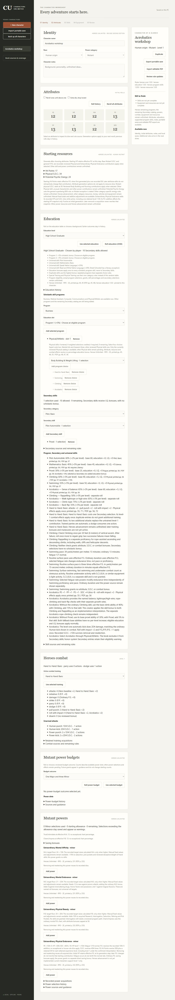
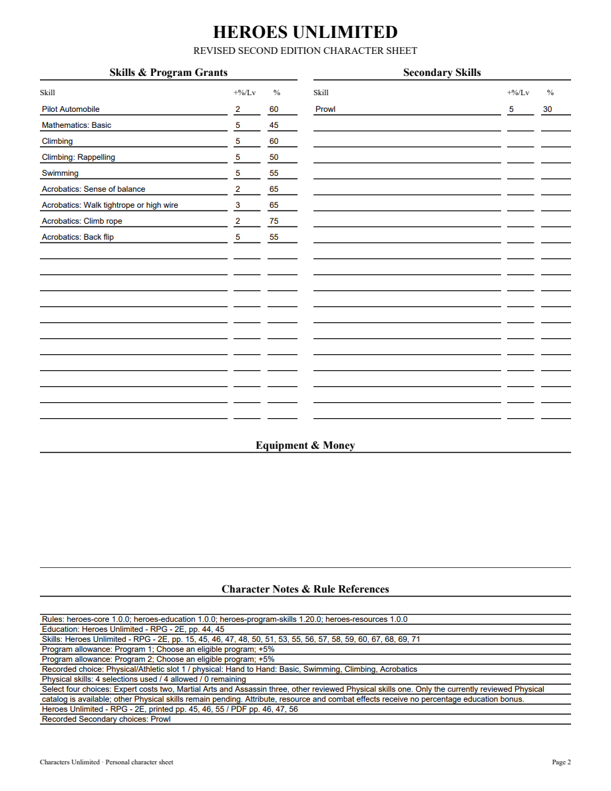
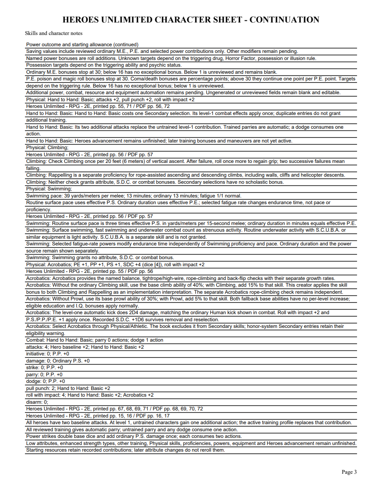
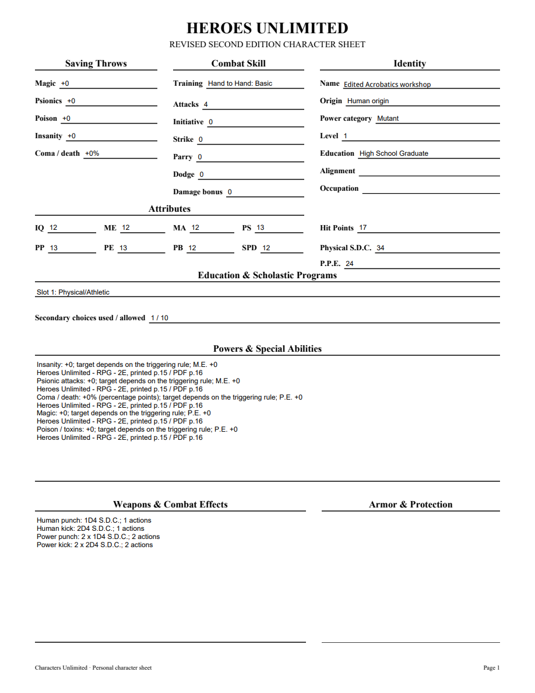

# 06S validation

Acrobatics was visually checked against original Heroes printed55/PDF56, checked Markdown3173–3198 and candidate122549354406cf4ac450. The checked source SHA is02927f54f7ebfc544629092464cb7c3430daa84683ced4ebf8a3e0607af77282. Named check rates are balance60+2, tightrope60+3, rope70+2, backflip50+5, fallback climb40+0 and prowl30+0. Attribute/resource/roll bonuses occur once and recorded dice survive removal/reselection. Normal Physical/Athletic cost1 and the Secondary exclusion/honor warning remain separate.

Six public Acrobatics tests cover rates/labels, ordinary skill replacement of fallbacks, source-bound Climbing/Prowl modifiers, removal/reselection and HP snapshots, fixed-stat priority, duplicate Secondary choices, portable rejection, explicit1.19 upgrade/inactive definition guards, outside-group/pending-repeat no-grant and editable PDF rates/source/interpretation disclosure. Initial tracer rejected the unavailable skill; it passes with1.20. Affected25 workflows pass in14.042seconds. Initial full345 tests passed in199.373seconds, one frozen-only skip; final full rerun follows a visual-review guidance correction. Required mypy --check-untyped-defs passes111 files; browser syntax/compile/whitespace checks pass. Windows pending.

Both independent reviews approve, including the narrow final guidance correction. Prior Climbing and other acquired Physical definitions remain identical; Prowl's only new-pack change is correcting its stale Acrobatics-pending wording. Earlier packs are unchanged. Applying the ordinary Climbing bonus to Rappelling is explicitly an implementation interpretation in the contract, browser and PDF; the optional user question had no reply before the stated recommended assumption was used. No claim of a confirmed user ruling.

Outside-group Physical choices previously could display a percentile despite having no credited Physical grant. Projection now filters those proficiency checks and passive modifiers consistently with retained acquisitions and effects. Existing honor-system Secondary selections still apply with their eligibility warnings.

Browser: removing Climbing exposes Acrobatics base climb45% with0 growth; reselection restores Climbing60/Rappelling50 and removes that fallback. Removing Acrobatics returns Climbing45/Rappelling35/Prowl25; reselection/reload restores60/50/30 using the same recorded D6 of4. Normal totals: P.S./P.P./P.E.13, attacks4/roll4, S.D.C.34/HP17, balance65/tightrope65/rope75/backflip55 with rates2/3/2/5. The normal program uses4choices and1 Secondary Prowl selection. All four final PDF pages and edited NAME were rendered with initialized forms and visually inspected. Reopened canonical fields agree with widgets; edited NAME has expected value and nonempty appearance. No Adobe compatibility claim.

[Editable sample](06s-acrobatics-sample.pdf)

The existing frozen Athlete verifies Wrestling first, then Acrobatics checks/rates and exact saved projection reopening without adding a fixture. Gymnastics, other maneuvers, Heroes advancement, equipment and full corpus remain open. Parent06/07/09 remain open.

Final full345 tests pass in195.305seconds with one frozen-only skip, after the guidance correction and regenerated PDF evidence. Final mypy111/compile/whitespace pass; browser syntax passed on the unchanged browser scripts. Windows pending.
