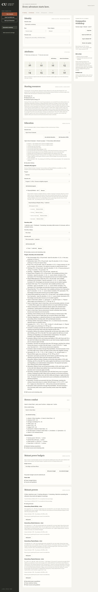
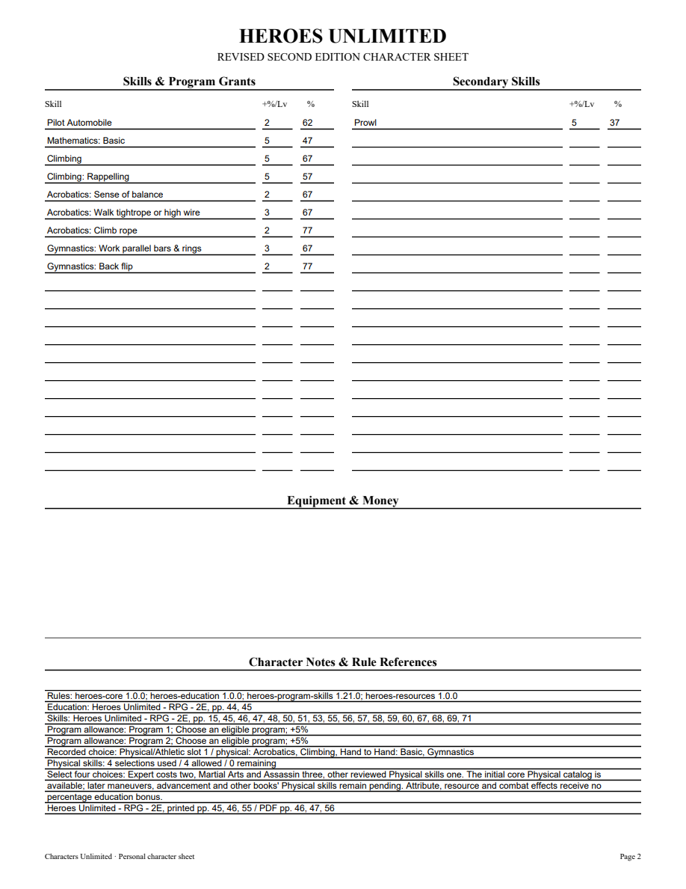
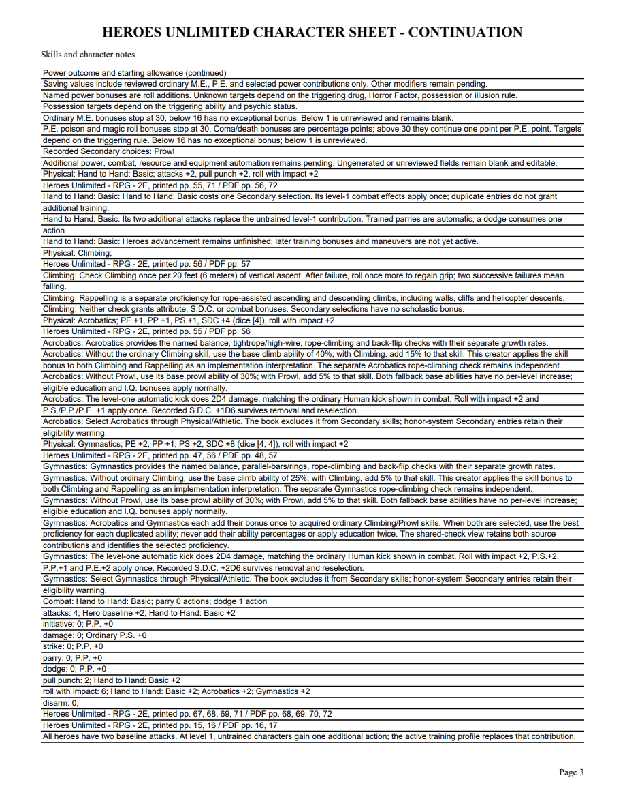
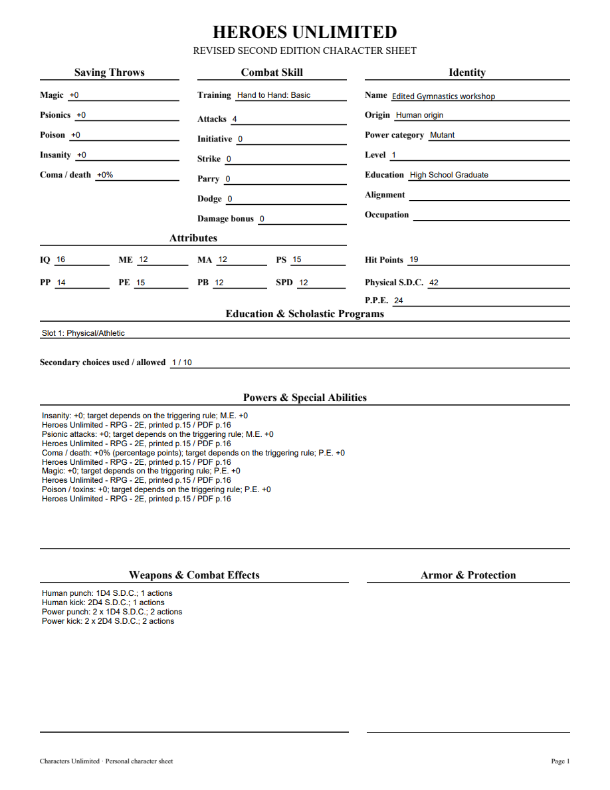

# 06T validation

Original Heroes printed47/PDF48 and printed56/PDF57 were visually verified against the checked Markdown ranges in the Gymnastics contract. The FAQ requires best duplicated Acrobatics/Gymnastics ability proficiency, with physical bonuses cumulative and education counted once. New immutable skills1.21 binds the relationship to Gymnastics; earlier acquired Physical definitions remain identical. Only Prowl guidance removes its stale Gymnastics-pending note.

Seven public Gymnastics tests cover named rates, ordinary skill bonuses/fallbacks, best shared checks and source provenance, mixed Secondary winners without borrowed education, aggregate physical bonuses, retained dice/starting HP, fixed attributes, portable roundtrip/rejection, old-pin upgrades/inactive definition guards, inactive/outside-group/repeat selections and editable PDF winners. The tracer first rejected unavailable Gymnastics. Affected27 workflows pass in13.928seconds. Full352 tests pass in183.380seconds with one frozen-only skip. Required mypy --check-untyped-defs passes113 files; compileall, browser syntax and whitespace checks pass. Both independent Standards and Spec reviews approve. Windows pending.

Browser normal High School scenario: fixedIQ16, Acrobatics/Gymnastics/Climbing/Basic and Secondary Prowl. PS15/PP14/PE15, attacks4/roll6, SDC42/HP19. Ordinary Climbing67/Rappelling57/Prowl37. Shared balance67/tightrope67/rope77 from Acrobatics, backflip77/bars67 from Gymnastics. Removing Gymnastics restores separate Acrobatics checks and Climbing62/Rappelling52/Prowl32; reselection and reload restore the shared winners with retained SDC dice4+4 and unchanged HP. Public tests additionally check removal resource totals and unchanged receipts/snapshots.

All five PDF pages and edited Name page were rendered with initialized forms and visually inspected. Each effective shared ability appears once; lower duplicated field names are absent. Canonical fields agree with widgets and nonempty appearance streams. Edited Name survives save/reopen. No Adobe compatibility claim. Rappelling bonuses remain an explicitly disclosed implementation interpretation, not a confirmed user ruling.

[Editable sample](06t-gymnastics-sample.pdf)

The existing frozen Athlete exercises Wrestling, Acrobatics, then Gymnastics and shared PDF winners before exact save/projection reopening. This completes the initial core Physical catalog entries only. Later maneuvers, Heroes advancement, other books, categories, powers, equipment and the full corpus remain open. Parent06/07/09 remain open; no final retrospective yet.

06T merged in PR85 asada710b649f09d43d2693cb91a17bbf319e62636 after Windows37202070110(9m10s)/37202072886(7m28s) passed, including packaged executable validation.
