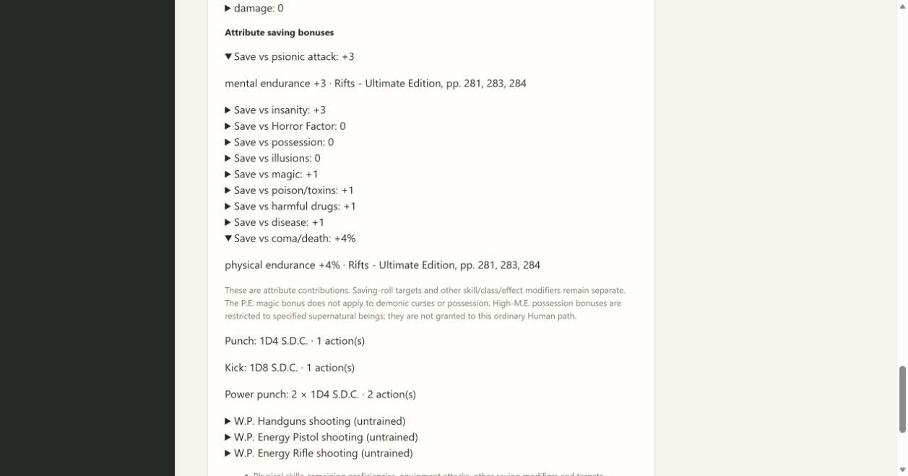
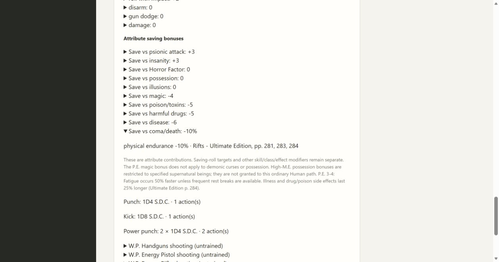

# 07B attribute saving validation

Skills 1.8.0 adds ordinary Human M.E./P.E. saving contributions and I.Q. illusion contributions. Original Rifts Ultimate Edition pp. 281, 283 and 284 were rendered and visually inspected, including low-attribute penalties, beyond-30 caps, the restricted high-M.E. possession rule, and the P.E. 30+ disease/fatigue context. Saving targets and other modifiers remain pending.

All 93 workflow checks pass (the frozen executable test is reserved for Windows CI), together with mypy over 36 files, Python compilation and JavaScript syntax. The four new application checks exercise fixed attributes, low/high values, caps, exact portable reopening, explicit old-version preview/apply and canonical PDF saving cells. A P.E. below 1 leaves the undefined magic cell blank.

Edge verification created a new character, fixed M.E. at 20 and P.E. at 16, and showed +3 psionic, +1 magic and +4% coma/death contributions with expanded source explanations. An older 1.7.0 character's update preview lists the added contributions; cancel retains its existing rules.

Ordinary, low and high attribute PDFs were rendered with PDFium forms enabled. Saving cells use the original reference geometry, including both poison cells and spell/ritual magic. Disease and illusion contributions appear in notes after the player's notes; low/high P.E. context and save exceptions continue onto editable continuation pages without overlap. Existing artwork and unsupported blank sections are preserved. Canonical editable values reopen correctly. The Spec review identified omitted low-P.E. context and PDF exceptions; bounded conditions and full caveat projection repair them, with a regression for range boundaries and long notes. Both Standards and targeted Spec re-review approve after correcting the P.E. 1-2 wording to include doubled penalties and the full damage scope.
