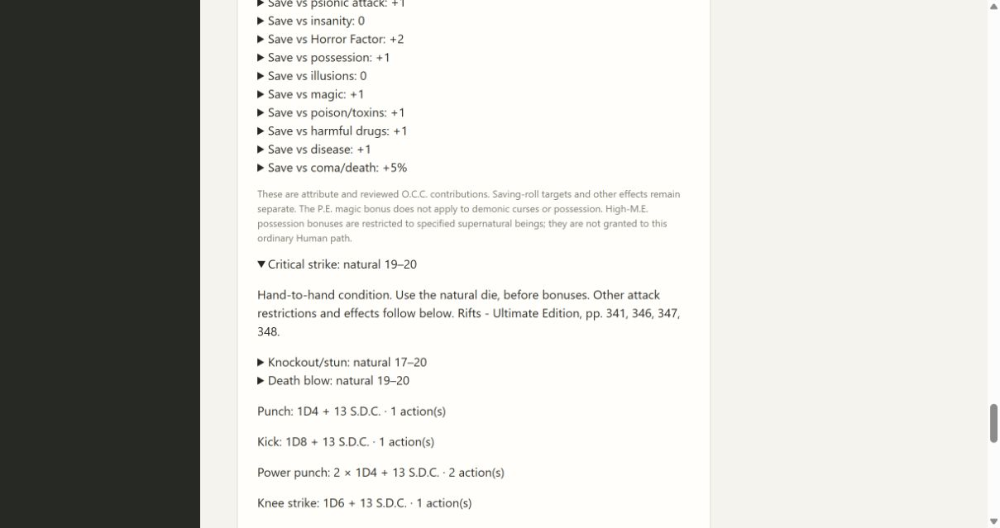
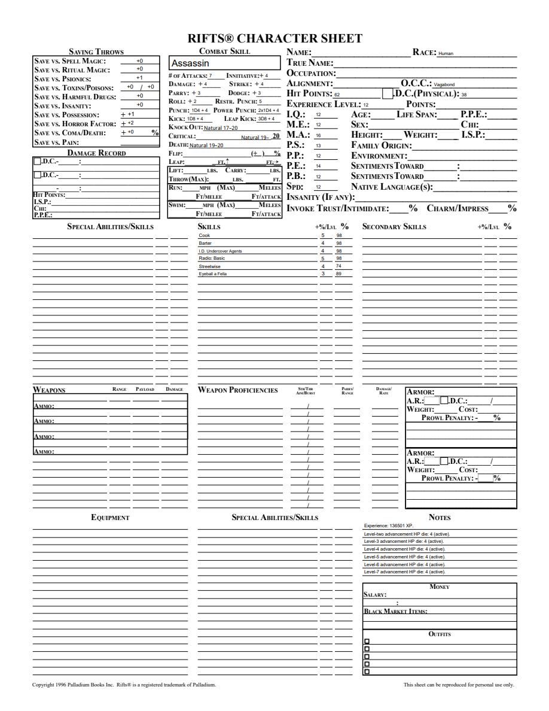

# 07B1 validation

Base:4a12a74. Scope: current ordinary Human/Vagabond four Hand to Hand styles; source facts and open boundaries are recorded in [the contract](../combat-maneuvers-contract.md).

Two public workflow tracers failed before implementation (missing natural conditions and missing Knee/Body Flip). They pass after immutable skills2.7.0 projection and native PDF mapping. Learned-age thresholds, style replacement, Martial sweep/trip no damage, Leap two actions, low-strength exceptions and editable form values are covered. A third public workflow confirms 2.6.0 remains unchanged until reviewed upgrade, preview thresholds, dice/resource/history retention, portable import, and undo restoring the historic2.6.0 pin without rolling.

Local full suite:218 tests passed, one frozen-only skip. After adding the historical-upgrade regression and frozen assertions, 19 focused progression/combat/upgrade/packaged tests passed with the same skip. Mypy75, compileall, all browser JavaScript syntax and diff whitespace pass.

Independent Standards review approved; independent Spec review found the reference Critical line's printed20 would duplicate the complete filled range. Repaired the editable field to a right-aligned prefix, preserving the static suffix and original artwork. Spec re-review approved after inspecting the rendered sheet. Root rendered with PDFium initialized forms and inspected native conditions/Leap. Critical and Death fields were changed, saved, and reopened successfully.

The browser loaded an existing level15 Assassin pinned2.6.0, previewed new moves/conditions, applied2.7.0, and displayed natural Critical19–20/Knockout17–20/Death19–20 plus Knee and Body Flip. Existing HP79 and all recorded progression dice were retained.

Windows frozen validation is required before merge. Parent07, full attack resolution, enhanced strength, other styles and full-corpus acceptance remain open. Power Kick is a separate pending interpretation.

Initial Windows run37162491385 failed in the new frozen assertion because the test requested nonexistent GET `/combat`; the public read interface is GET `/skills` → `combat`. Corrected the test endpoint; runtime behavior was unchanged. Required Windows checks are rerun on the repair before merge.
