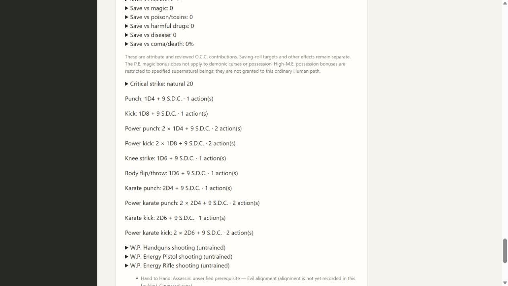
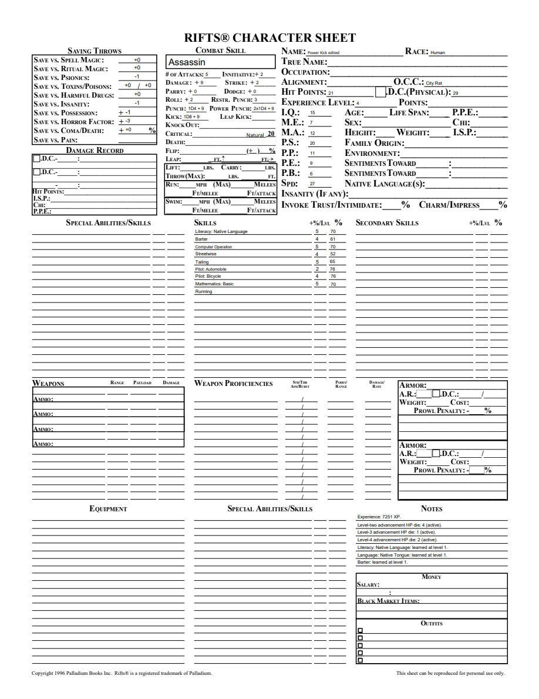
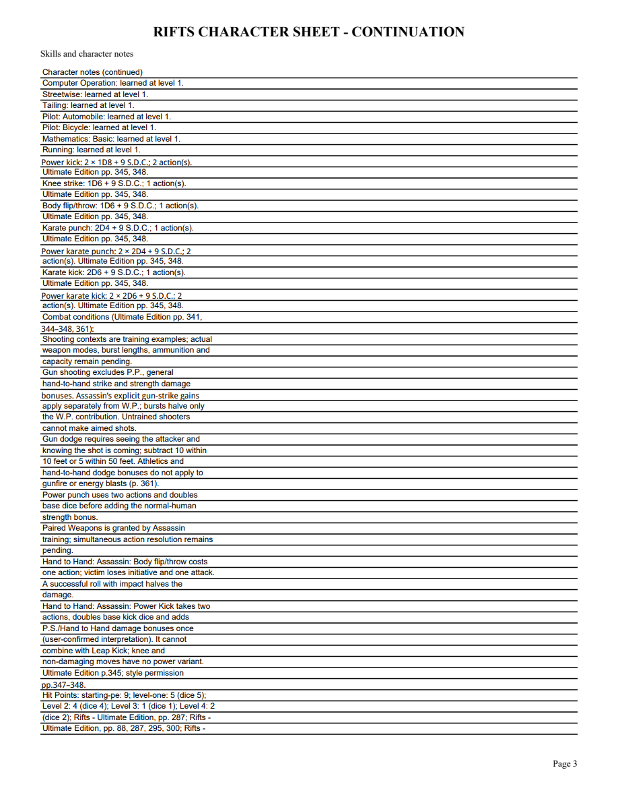

# 07B2 validation

Source RUE printed345/PDF348 describes Power Kick, two actions and Leap exclusion. Style tables347–348/PDF350–351 explicitly exclude Basic and permit Expert, Martial Arts and Assassin. User confirmed double base dice, then add PS/Hand to Hand damage bonuses once. Immutable skills2.12 modifies only the relevant permission flags, Karate Kick eligibility, notes/source in shared and City Rat combat profiles.

First public tracer failed with missing power-kick. Green Assassin4/PS20 gives2×1D8+9 and2×2D6+9, two actions each, with no power Knee/Flip/Leap. PS4 retains½×(2×2D6+4), without inventing rounding. All three permitted style Karate unlocks use learned age; late Expert at15 has ordinary Power Kick but no Karate variant. Old2.11 preview/apply preserves dice/resources/acquisitions/training; historical undo restores2.11 and removes the new attack. Portable/reopen retains learned moves and exact pins.

Focused23 tests passed, full244 tests passed with one frozen-only skip. Spec identified an incomplete low-PS warning; the added regression failed and then focused12 passed after repair. Mypy88 with untyped-body checking, compileall and whitespace pass. Both independent reviews approve. Frozen Windows validation additionally checks City Rat Basic exclusion, Expert two-action Power Kick, no early Karate and PDF continuation.

Browser City Rat Assassin4/PS20 displays both+9 power kick expressions, two actions and source/ruling guidance. Reopen preserves them. Four-page editable PDF renders native normal kicks and both power variants on matching continuation. Edited NAME persists after reopening. Changed pages rendered with initialized AcroForms were visually checked.

PS1–2 power damage remains explicitly pending; other strength types/combat/full class coverage remain open. No final release or retrospective is claimed. Merged PR #66 as aa55eeaf33fa8ed242df727b19472cda2a9fcfa7 after both Windows full/frozen workflows passed (37173958829 and 37173965199).
