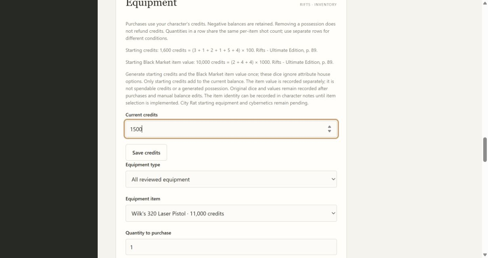
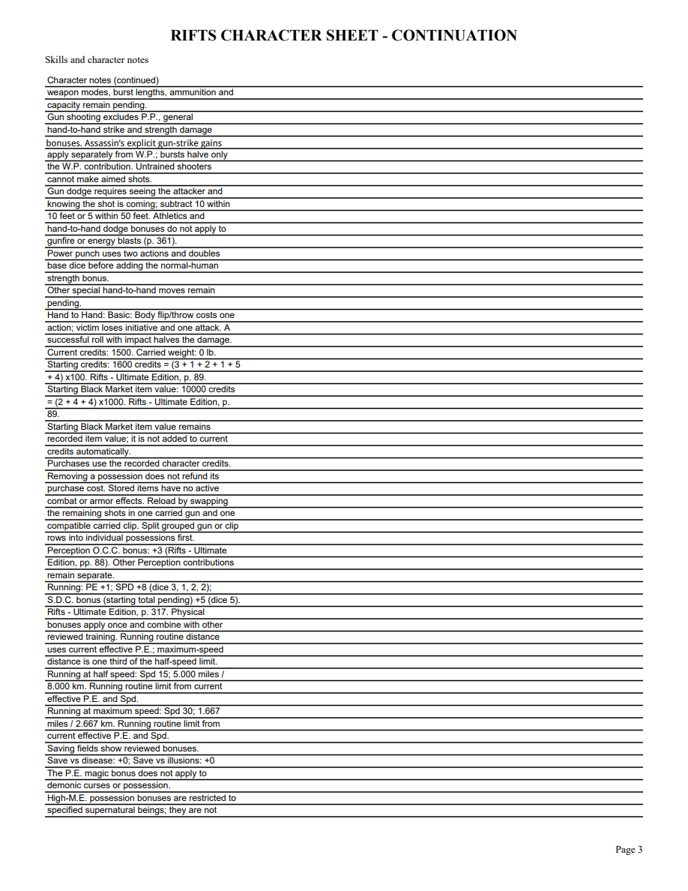
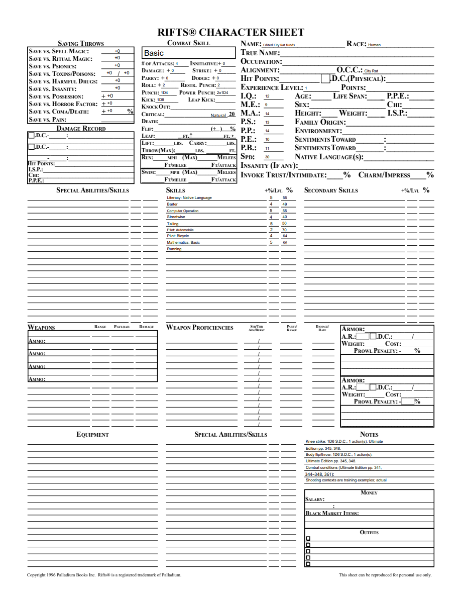

# 08B4 validation

City Rat starting funds use Ultimate Edition printed p.89/PDF92: six D6 times 100 credits and one Black Market item valued at three D4 times 1000. Equipment1.6 adds only the class profile; the shared catalog and Vagabond definitions stay unchanged. Skills2.11 changes only version and completed-gap guidance.

Public tests verify exact dice calls despite attribute house options, once-only generation, only credits added to the current balance, separate original item value, persistence, portable import, PDF values, old1.5 pins, reviewed upgrade without dice, advancement/undo and rejection of changes to recorded rules. The Windows frozen workflow includes generation, import and restart checks for City Rat.

Full local suite:231 tests pass, one frozen-only skip. Following review fixes, focused11 tests pass; mypy82 and diff whitespace pass. Compileall and all browser script syntax checks passed before the two focused wording/source repairs. Independent Standards and Spec reviews approve after repairs. Windows full/frozen validation must pass before merge.

Browser verification created City Rat, generated 1600 starting credits and 10000 Black Market item value, changed current credits to1500 and reopened with original records retained. PDF fields retain these distinct values; the four-page PDF was rendered with initialized AcroForms. Page3 shows both records and p.89. Edited NAME persists in the reopened/rendered PDF. Review repaired the item label and added p.89/PDF92 to upgrade-preview Sources, protected by public assertions.

City Rat item identity, starting equipment, cybernetics, full class review and parent tickets remain open. No full-scope completion or final retrospective is claimed.
