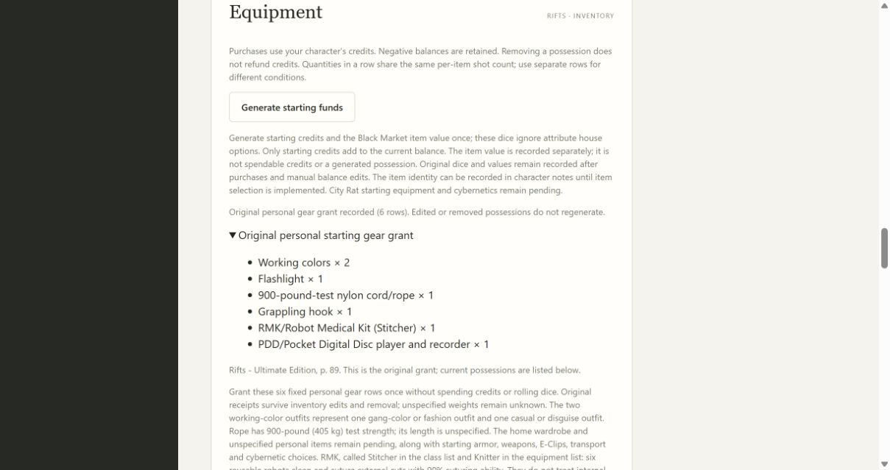
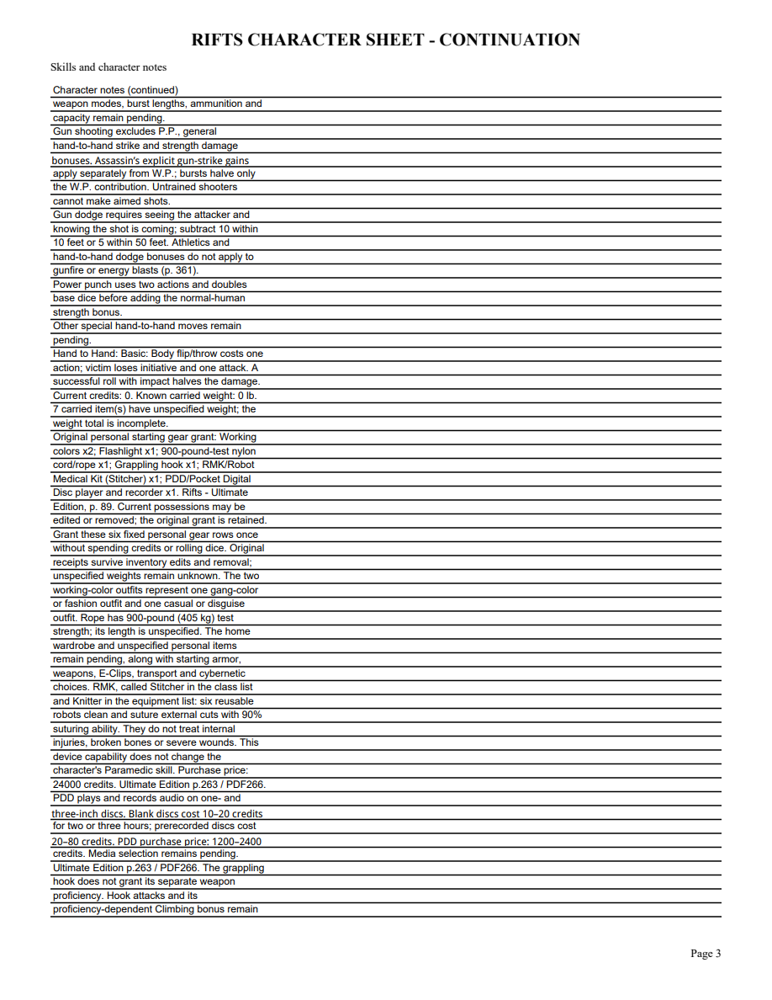
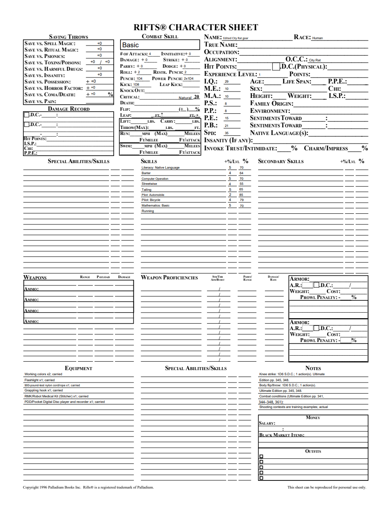

# 08B5 validation

Original Ultimate Edition p.89/PDF92 and p.263/PDF266 were visually checked. Fixed gear: working colors x2, flashlight,900-pound-test nylon cord/rope (no length supplied), grappling hook,RMK andPDD. The supplemental source confirms RMK24000 credits /90% suturing with exclusions andPDD1200–2400 credits. Device capabilities do not modify character proficiency; separate grappling-hook proficiency remains pending.

Red public tracer initially rejected City Rat as unsupported; green grants six rows/seven units without dice or spending funds. The second red tracer exposed missing gear source in upgrade-preview Sources; green includes p.89/PDF92. Public tests cover original funds/resources, once-only receipt, unknown weights, manual removal, duplicate/import/reopen, old1.6 explicit upgrade, progression/undo and rejection of changed recorded gear definitions. Frozen Windows flow now covers gear grant/import/restart.

Focused16 tests pass. Full local suite233 tests pass with one frozen-only skip. Mypy with untyped-body checking passes83 files. Browser scripts and diff whitespace pass. Both independent Standards and Spec reviews approve. Windows full/frozen checks must pass before merge.

Browser created City Rat and added gear through the generic action; expanded receipt shows six rows/source and survives reopening. Four-page editable PDF rendered with initialized AcroForms shows current gear on the native sheet and original grant/capabilities on page3. Edited NAME persists on reopen/render.

Full City Rat equipment/class and parent tickets remain open. No final release or retrospective is claimed.

Merged PR #62 as8b9a3d2 after Windows full/frozen runs37169609814 (4m41s) and37169611902 (4m31s) passed.
