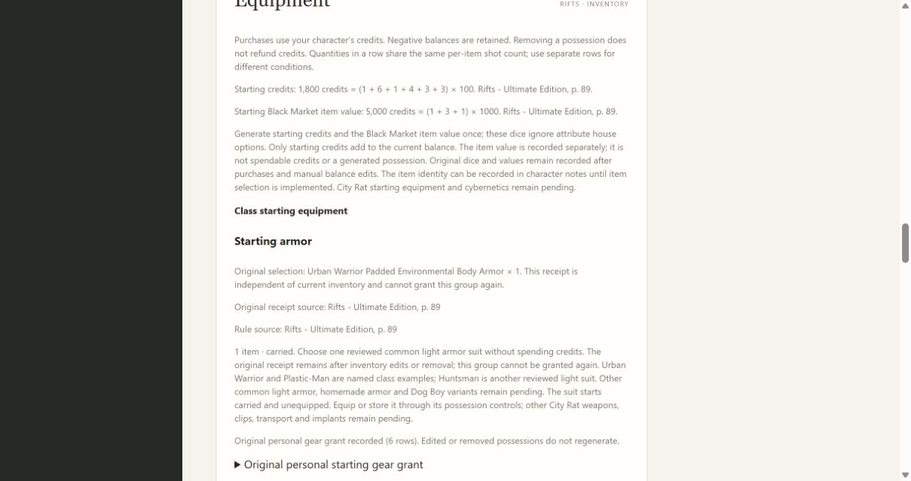
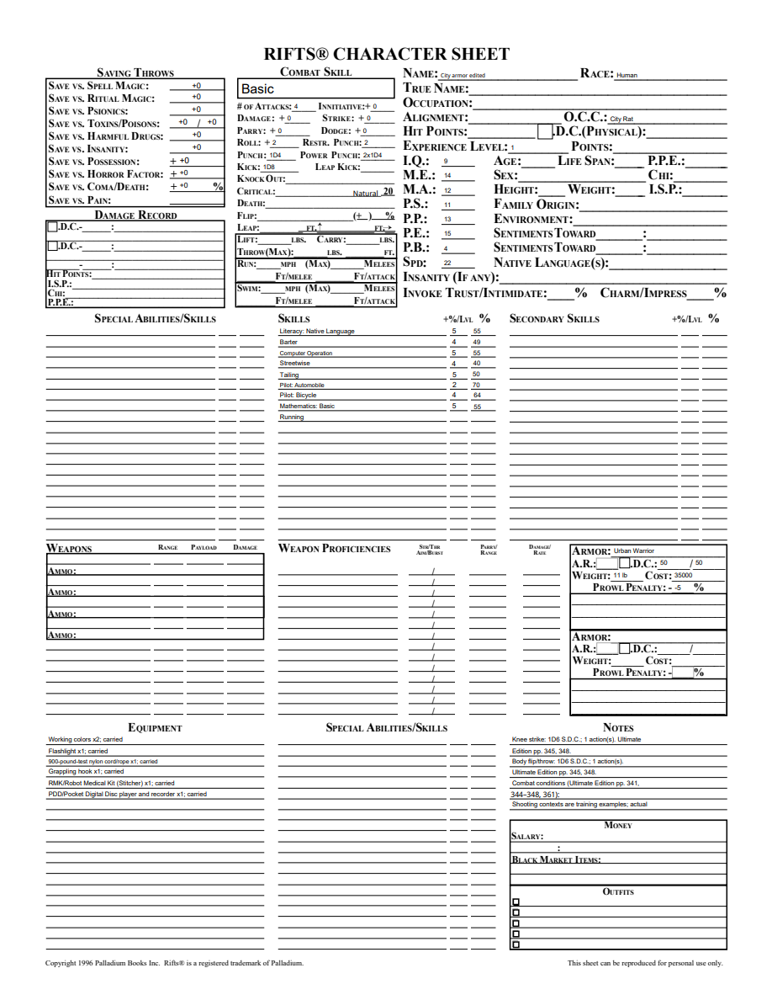
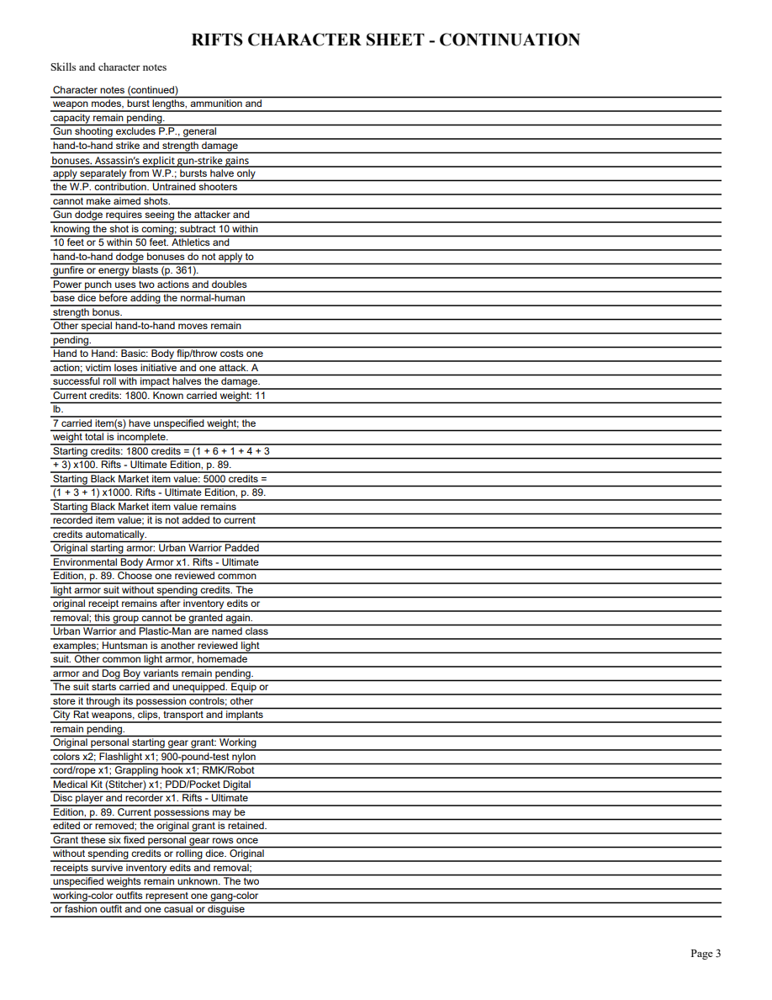

# 08B6 validation

Original Ultimate Edition printed p.89/PDF92 permits common light starting armor and names Urban Warrior and Plastic-Man. Huntsman is reviewed light armor on p.268/PDF271. Equipment1.9 adds only the version and independent City Rat armor group; archived definitions remain intact.

Public tracer initially failed because the group grant method was absent. Focused16 tests pass through CharacterApplication, including free acquisition, funds/fixed gear retention, once-only receipts after removal, exact-pin upgrades, portable/reopen/duplicate, advancement/undo, new unacquired groups and rejected tampered receipts or changed acquired definitions. Full local suite:239 tests pass, one frozen-only skip. Mypy86 with untyped-body checking, compileall, browser syntax and diff whitespace pass. Both independent Standards and Spec reviews approve.

Browser generated1800 credits and5000 Black Market item value, granted six fixed gear rows, then selected Urban Warrior freely. Seven current inventory rows retain1800 credits,11lb known carried weight and seven units with unspecified weight. Equipping and reopening preserves the original armor receipt and all armor effects. Five-page editable PDF has Urban main-body50,11lb,35000 catalog cost and Prowl-5; the original free starting armor receipt appears independently on the continuation. Edited NAME survives reopening. All pages with changed content rendered with initialized AcroForms and were visually checked.

Windows full/frozen validation precedes merge. Other common light armor, City Rat weapons/clips/transport/implants and full class/equipment acceptance remain open. This is not final release acceptance or the retrospective.

Merged PR64 as6545e0f after both Windows full/frozen workflows passed.
