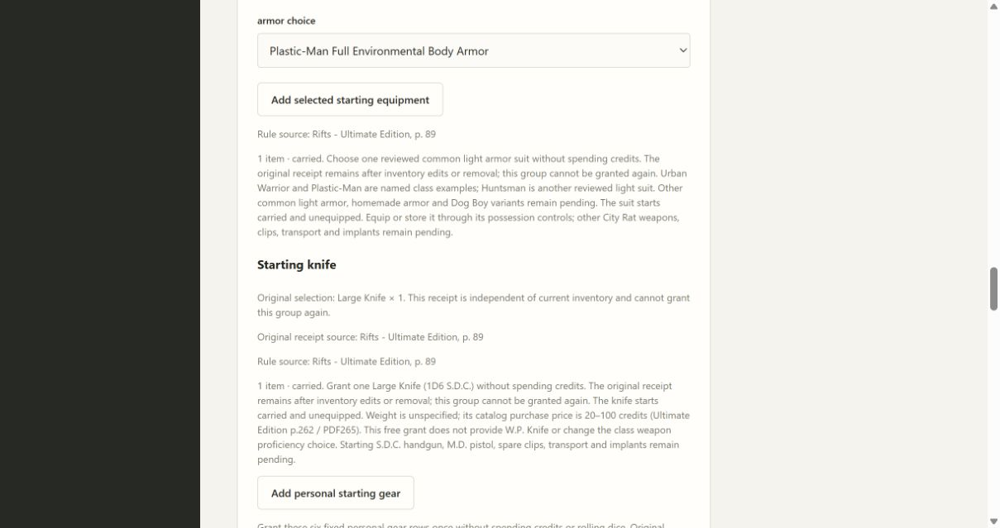
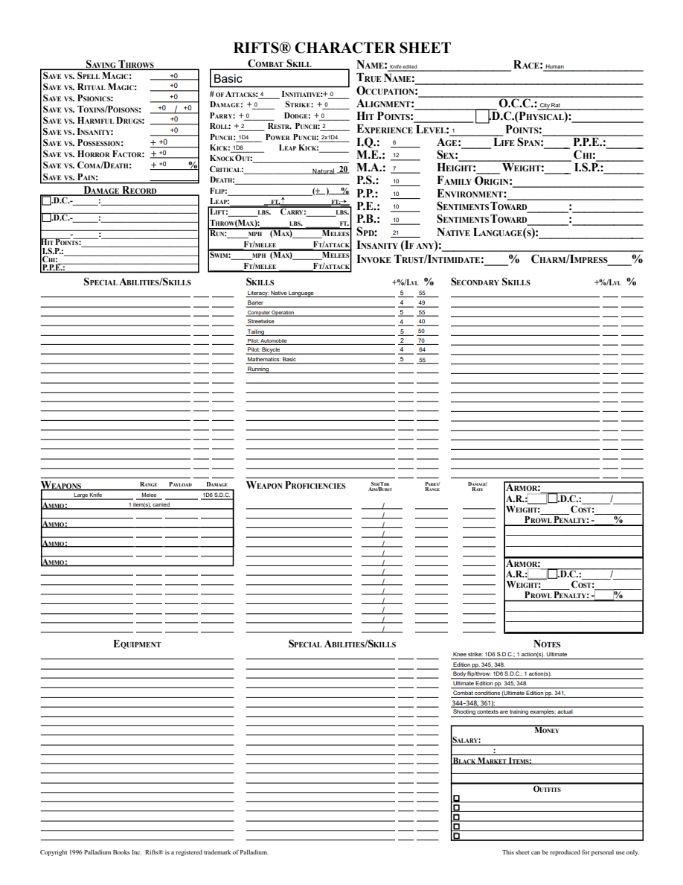
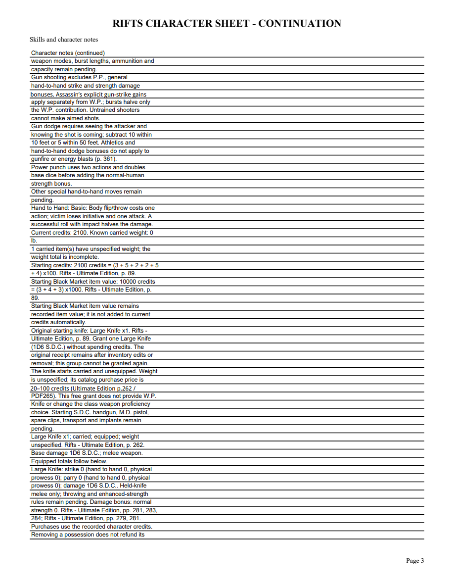

# 08B7 validation

City Rat Standard Equipment printed p.89/PDF92 explicitly grants a1D6 S.D.C. knife. Basic Gear p.262/PDF265 supplies the existing Large Knife definition and20–100 credit purchase range; weight is unspecified. Equipment1.10 changes only version and adds the independent knife group. Armor definitions, catalog and original fixed gear remain unchanged.

The public tracer initially failed because the knife group was unavailable. Green checks grant free without dice or W.P., preserve2400credits/fixed gear/armor/resources/combat, produce eight inventory rows with11lb known weight/eight unknown-weight units, and retain original receipt after removal, import, advancement and undo. A second public example upgrades an acquired1.9 armor receipt without changing inventory, rejects Small Knife, exercises knife-before-armor and rejects Vagabond use. Focused18 tests passed; mypy87, compileall and whitespace checks pass. Local suite241 passed with one frozen-only skip before the display correction; focused12 pass afterward; final full suite precedes merge.

Spec review identified stale fixed-gear pending text. A public regression failed, then passed with display-only correction based on available groups, preserving immutable rules and receipts. Standards and Spec both approve the final repair. Windows frozen workflow now grants/equips knife and verifies original receipt in the editable sheet, imported save and restart.

Browser independently grants knife first, retains2100credits and leaves armor available. Equip/reopen retains1D6 S.D.C. melee and the once-only receipt. Four-page editable PDF renders Large Knife in native weapon fields and the original receipt on continuation. Edited NAME persists on reopen. Changed pages rendered with initialized AcroForms were visually checked. Corrected guidance is visible after restart.

Handgun, M.D. pistol/spare clips, transport, implants and full class/equipment acceptance remain open. No final release or retrospective is claimed.
Final full local suite after guidance repair:241 tests pass, one frozen-only skip.

Merged PR65 ase670451 after both Windows full/frozen workflows passed.
