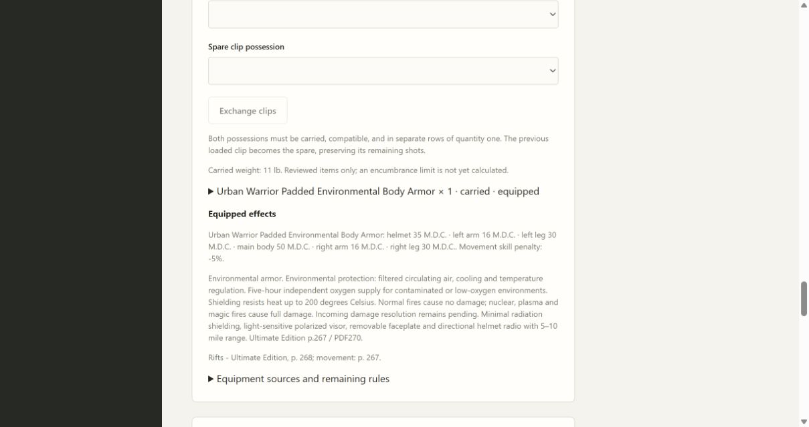
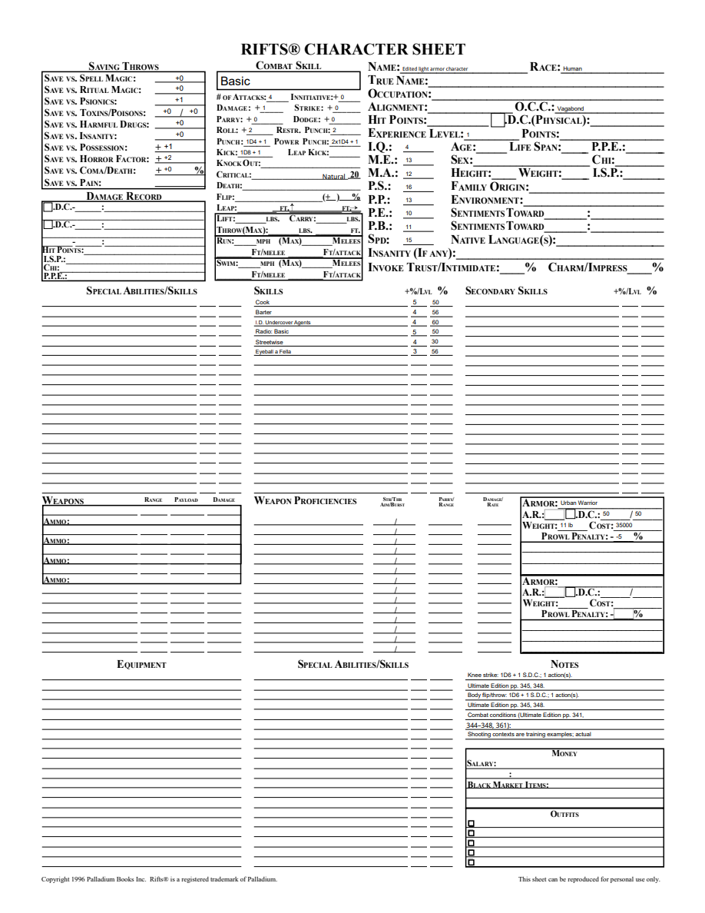
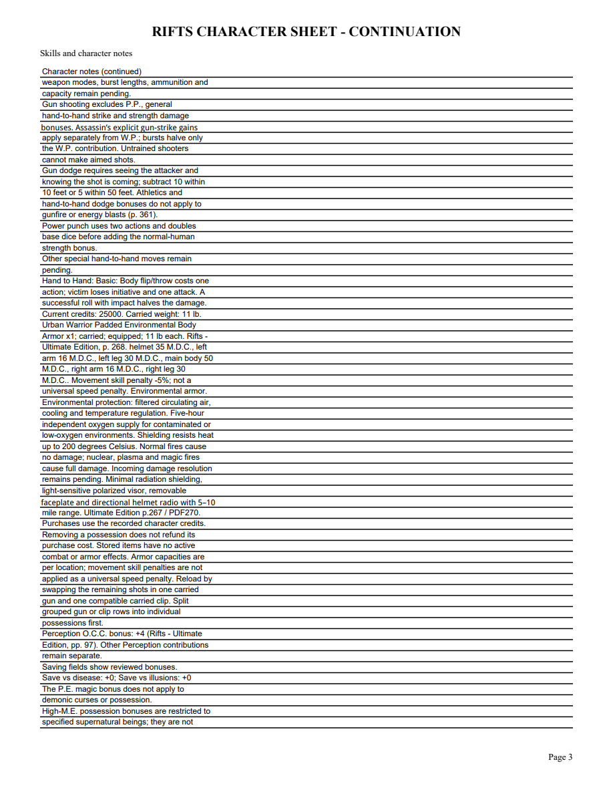

# 08D1 validation

Original Ultimate Edition printed pp.267–268/PDF270–271 were visually checked. Urban Warrior: main50/helmet35/arms16/legs30MDC,11lb,35000credits,-5% movement, environmental. Huntsman:45/35/15/25,16lb,24000credits,-10%, non-environmental. The explicit source penalties take precedence over generic armor-weight categories.

First public tracer rejected unknown armor. Green purchase/equip/store verifies60000→1000credits,27lb carried, separate capacities and multiarmor warning; storing Huntsman leaves11lb and only Urban active. Public exact-pin update keeps1.7 Plastic-Man definitions until review/apply without altering inventory or attributes. Portable/reopen preserves projection. Frozen Windows checks now purchase/equip Urban on City Rat and verify native PDF.

Standards review identified the native Prowl box incorrectly taking Huntsman’s general movement penalty. A public regression failed(-10 vs blank); green uses an explicit nullable Prowl mapping: Urban-5/Plastic-10/Huntsman blank, retaining Huntsman-10 in notes and archived Plastic behavior. Spec review requested Huntsman’s split heading candidate alongside its stats candidate; provenance includes both.

Focused15 tests passed before review; focused12 passed after Prowl repair. Mypy84 with untyped-body checking, compileall, browser syntax and diff whitespace pass. Final local suite and Windows full/frozen validation precede merge. Standards approves; Spec approves after the provenance fix.

Browser purchased/equipped Urban with25000credits remaining,11lb and individual location capacities; environmental notes and source persist on reopen. Four-page editable PDF rendered with initialized AcroForms shows Urban main-body50,11lb,35000credits and Prowl-5 in native fields. Continuation shows complete capacities/protection and p.267–268. Edited NAME persists on reopen/render.

City Rat starting armor, other suits, contextual skill/incoming damage resolution and full equipment/class coverage remain open. No final release or retrospective is claimed.

Final local suite:236 tests pass, one frozen-only skip. Subsequent source-heading metadata repair passes focused armor/archive checks.

Merged PR #63 asa6b2f09 after Windows full/frozen runs37170766493 (5m7s) and37170768485 (4m57s) passed.
