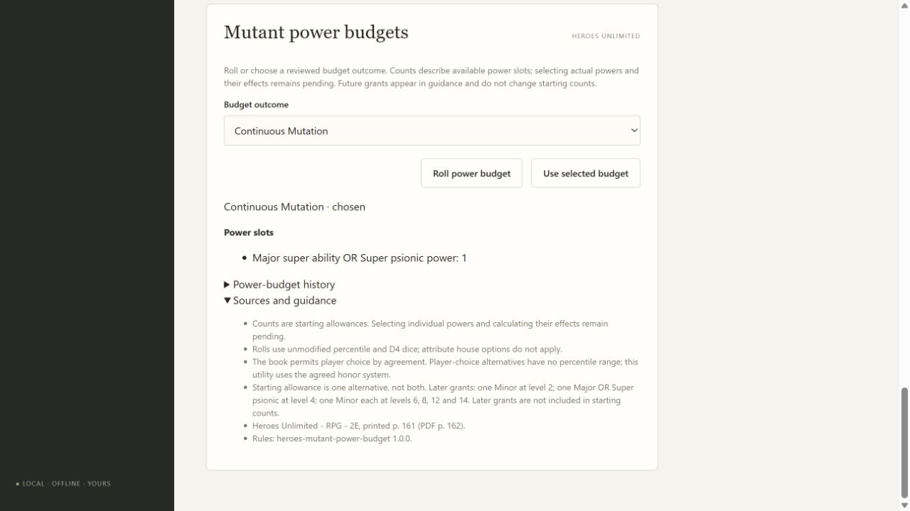
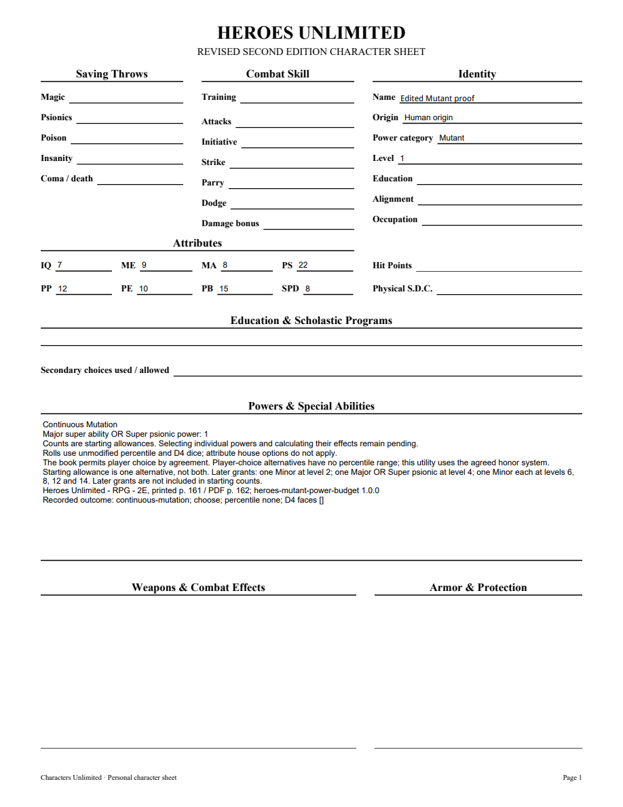

# 09A1 validation

HU Revised Second Edition printed p.161 / PDF p.162 has nine percentile outcomes; original PDF pages162–163 were rendered and visually checked against corrected candidate3ba2867451865c045449 and unstable continuation2a40e1a454515d14ee13. The immutable heroes-mutant-power-budget1.0.0 pack retains those ranges and separate choice-only alternatives.

First CharacterApplication tracer failed because select_power_budget was absent. Green roll70 + D4 face4 gives one Major and six Minor psionic powers, with exact pin/history retained on restart and portable import. Boundary tests cover both ends of every range. Psychic Mutant records three independent D4s. Continuous Mutation starts with one alternative and lists future grants separately. Unstable Powers states that its additional table remains pending. Invalid percentile/count dice, stale writes, malformed history, missing pins and cross-game records reject without altering saved characters.

Full local suite passed247 tests with one frozen-only skip before the final boundary/snapshot regressions. Final focused8 power/PDF tests pass; mypy passes90 files with untyped-body checking, Python compile and JavaScript syntax checks pass. Independent Standards and Spec reviews approve. Standards found a PDF double-read race, repaired by projecting from the loaded character; the public snapshot regression covers concurrent outcome edits. Windows frozen validation now additionally chooses Continuous Mutation, checks its one starting allowance, and retains it through import and restart.

Browser creation, selection and reopening preserve the outcome and one allowance. Three-page editable PDF renders the outcome, counts, source and history; edited NAME persists on reopening, using a regenerated appearance for the edited widget. PDFium initialized AcroForms and rendered the changed page for visual inspection. A diagnostic whole-page pypdf appearance regeneration clipped unrelated Unicode-font fields; the normal export and individual widget edit retain their complete appearances. That tooling behavior is not claimed as viewer compatibility proof.

Individual power selection/effects, psionic category identities, unstable outcomes, physical mutations, resources and Heroes advancement remain pending. Parent09 and full corpus acceptance remain open; this is not the final delivery or retrospective.

Merged PR #67 as ec35d84da0db30094e03b665736332189e8dc3d1 after both Windows full/frozen workflows passed (37175170720 and 37175182540).
