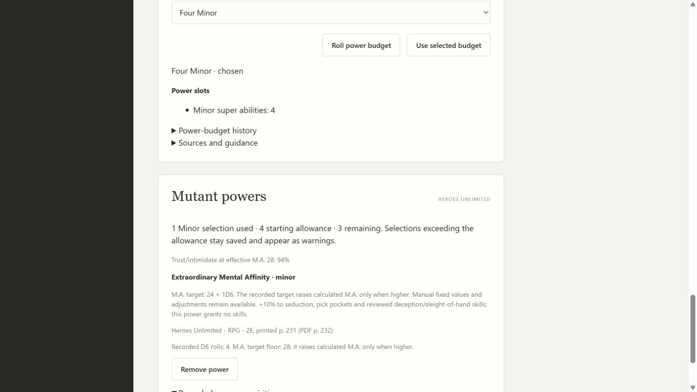
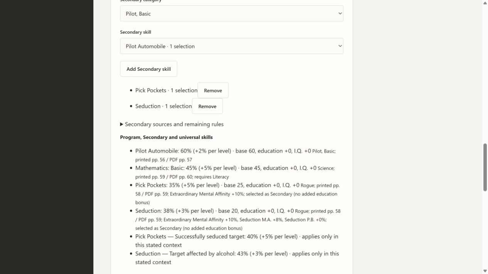
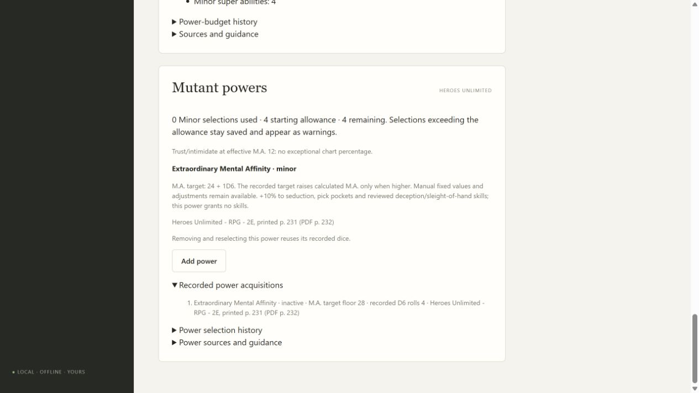
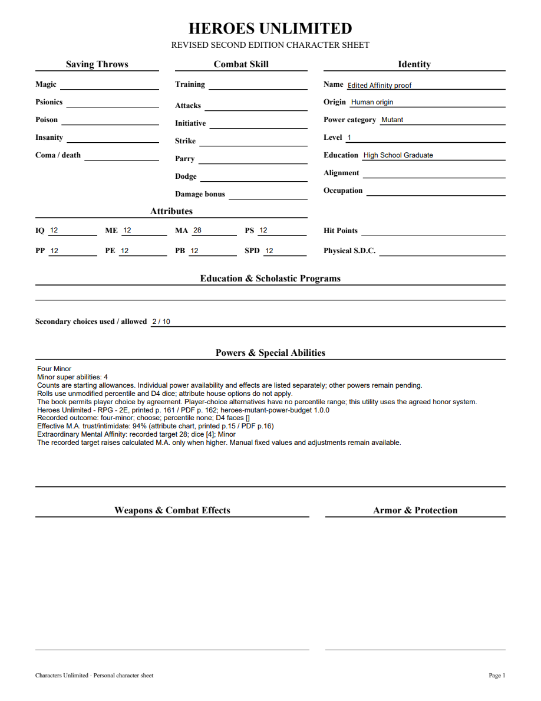
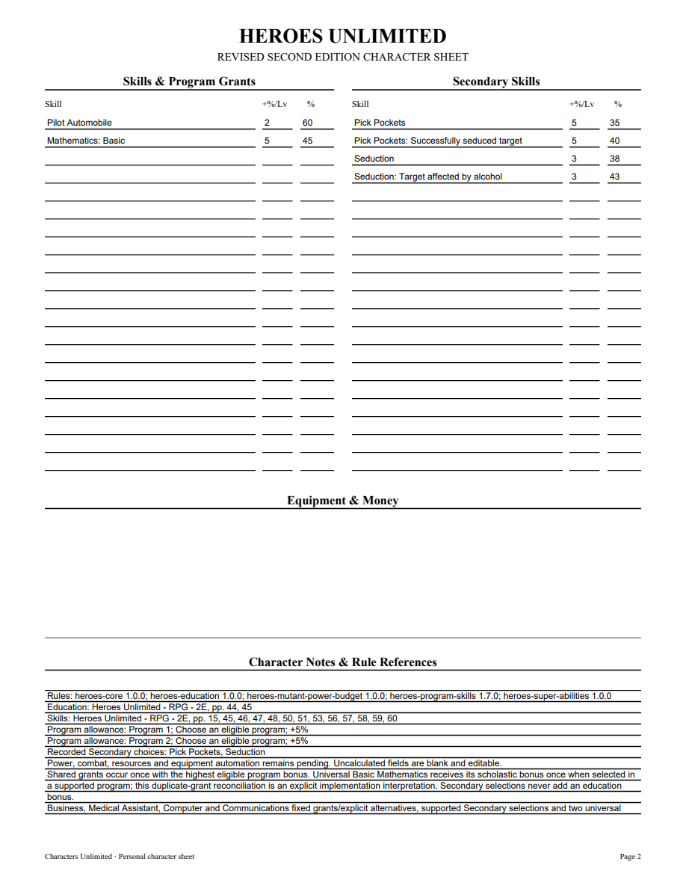
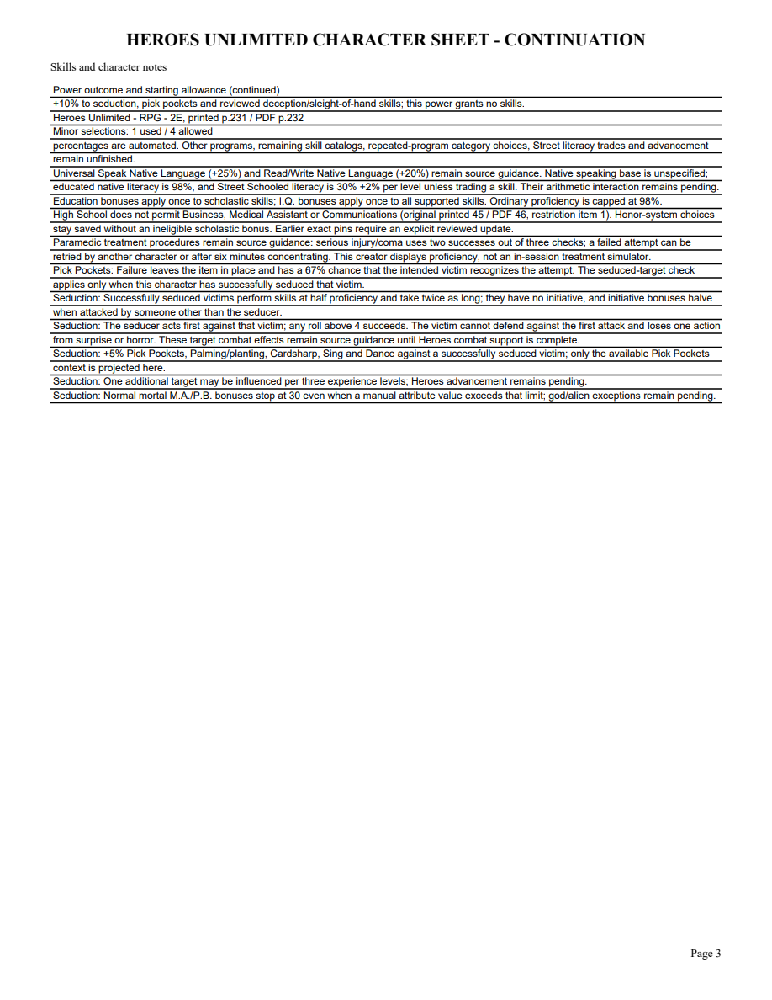

# 09A2 validation

Chosen Extraordinary Mental Affinity uses the user-confirmed higher of calculated M.A. and the recorded 24+1D6 target. HU printed p.231 / PDF p.232 and the attribute chart printed p.15 / PDF p.16 were rendered and checked against corrected Markdown. Supporting Pick Pockets and Seduction rules were checked on printed p.58 / PDF p.59; ordinary attribute bonuses stop at 30.

The first application tracer failed because power selection was absent, then passed with D6=4, target28 and trust/intimidate94%. Separate red/green regressions cover the ordinary attribute-bonus cap and orphan acquisition history. Public checks protect stacking once, no implicit skill grants, fixed values, higher scores, remove/reselect without rerolling, reroll history, portable import, restart, duplication, exact sources, stale writes, malformed dice and cross-game rejection. Inactive receipts retain target/dice/source in the builder and PDF. Honor-system selections exceeding the budget remain saved with warnings.

Full local suite:256 tests pass, one frozen-only skip. An earlier run exposed a stale active-version fixture expecting1.6 rather than1.7; corrected before the final full run. Final focused10 power/PDF tests pass after adding selected-skill guidance to PDF continuations. Mypy passes92 files with untyped-body checking; Python compile, all browser JavaScript syntax and git diff whitespace checks pass.

Independent Standards and Spec reviews approve. Standards found orphan receipt history and missing inactive receipt projection; both repaired with public regressions. Its initial-frame concern was withdrawn: existing lazy first-roll snapshots legitimately include powers acquired before rerolling.

Browser proof: target28/D6[4], trust94%, one of four Minor allowances, Pick Pockets35% (seduced context40%) and Seduction38% (alcohol context43%). Removing and reselecting reuses the recorded die. Three-page editable PDF was rendered with initialized AcroForms and visually inspected on every page. A NAME widget edit was saved, reopened and rendered while preserving other appearances; this does not claim Adobe viewer compatibility testing.

[Editable sample](09a2-affinity-sample.pdf)

Other powers, complete Rogue catalogs, target combat effects, Heroes combat/resources/advancement, other character categories and full supplied-book acceptance remain open. This is a bounded slice, not final delivery or retrospective.
