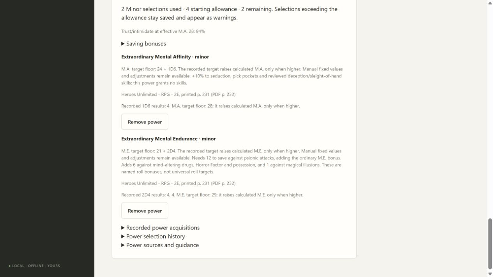
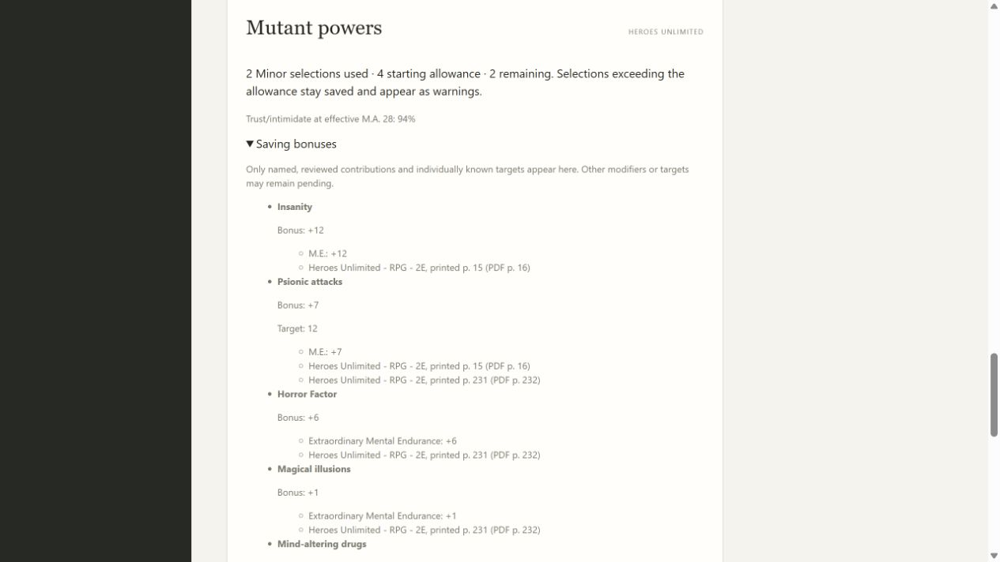
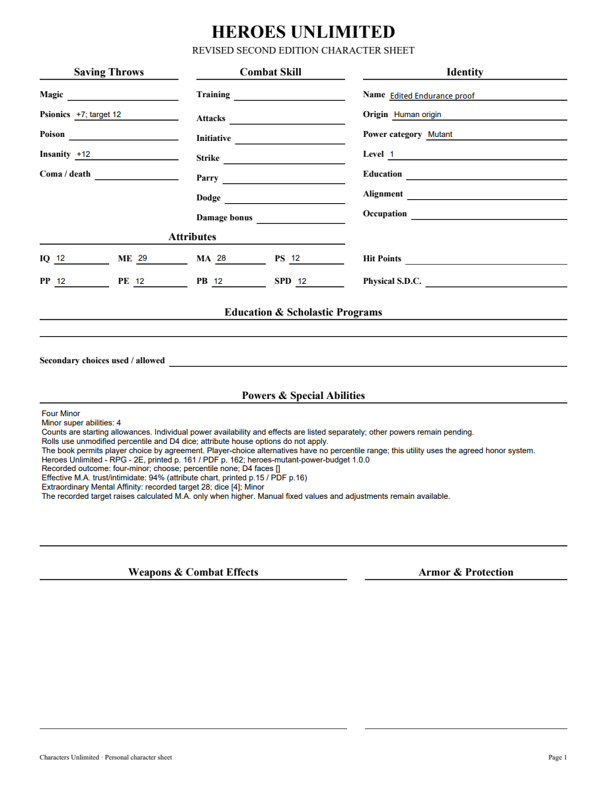
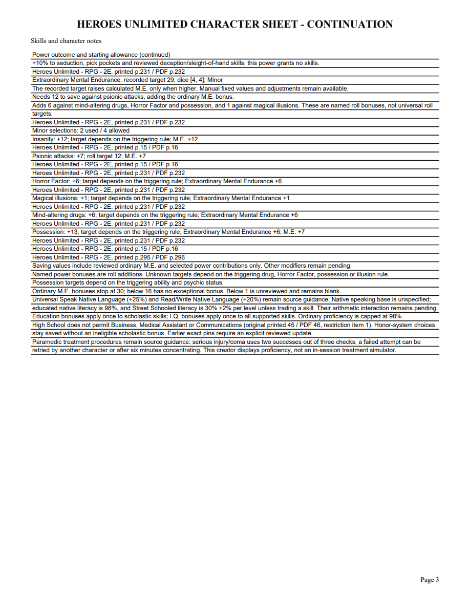

# 09A3 validation

Extraordinary Mental Endurance printed231/PDF232, candidate730a462645e78f2dd67c, was checked against corrected Markdown and a rendered original page. The ordinary M.E. chart printed15/PDF16 was visually reviewed. Transferal/Possession printed295/PDF296 and general psionic save rules printed297/PDF298 were rendered and checked: possession adds ordinary M.E. psionic bonus and the power's6. The user confirmed that M.E. and P.B. retain the higher calculated score or recorded target, matching M.A.

First public tracer rejected the unavailable power, then passed with independent D4 faces4/4, target29 and psionic bonus7 against target12. Separate red/green checks cover explicit1.0-to1.1 power-pack updates, editable save fields, and possession13 instead of6. Five public power tests cover manual higher values, capped ordinary bonuses, retained acquisitions on remove/reselect, restart/import, invalid D4 values, incomplete imported dice and rejected incompatible acquired-definition updates. Seven earlier M.A. cases and three scholastic update cases pass alongside them.

An initial full run encountered one transient accepted-hash rejection while the root edited the new uncommitted pack and manifest during the run, and one stale PDF fixture expecting newly supported saving values to remain blank. The fixture now checks ordinary+0 psionic/insanity fields and source guidance; the rerun holds product files stable. Final stable full run passes261 tests (one frozen-only skip) in261.948 seconds. Final mypy93 files, Python compile, all JavaScript syntax and whitespace checks pass. Focused12 power/PDF/melee checks also pass after the fixture repair.

Standards: APPROVE, no actionable violations or data integrity findings. Compatible updates check all retained acquisitions, including inactive ones, preserve recorded dice and retain revision/token/backup/export validation. Spec: APPROVE; targets and roll bonuses remain separate, possession stacks correctly, and unknown drug/illusion/HF/possession targets remain qualified. Optional psychic-status wording was incorporated.

Browser reopening shows M.E.29, two original D4 faces, two of four Minor selections, psionic+7/target12, insanity+12, possession+13, drugs/HF+6 and illusions+1. Remove/reselect restored the same faces and bonuses. Three-page editable PDF renders those fields and complete contribution/source continuations. NAME was edited in its individual appearance, saved and reopened, then rendered with initialized AcroForms. Every PDF page was visually inspected; this is not an Adobe viewer compatibility claim.

[Editable sample](09a3-endurance-sample.pdf)

Full Heroes modifiers, trigger-specific drug/illusion effects, psychic categories, remaining powers/resources/combat/advancement and full corpus acceptance remain open. This is a bounded slice, not final delivery or retrospective.
