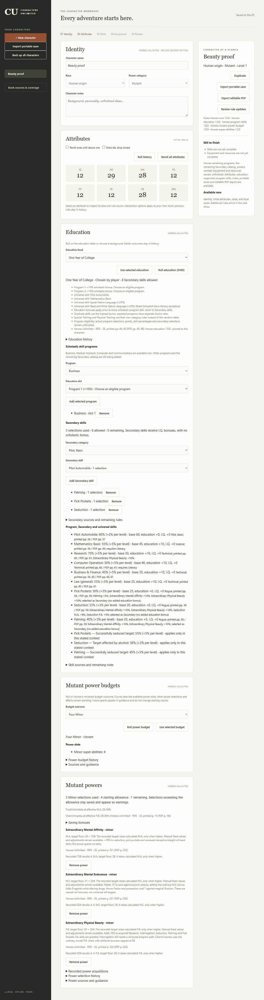
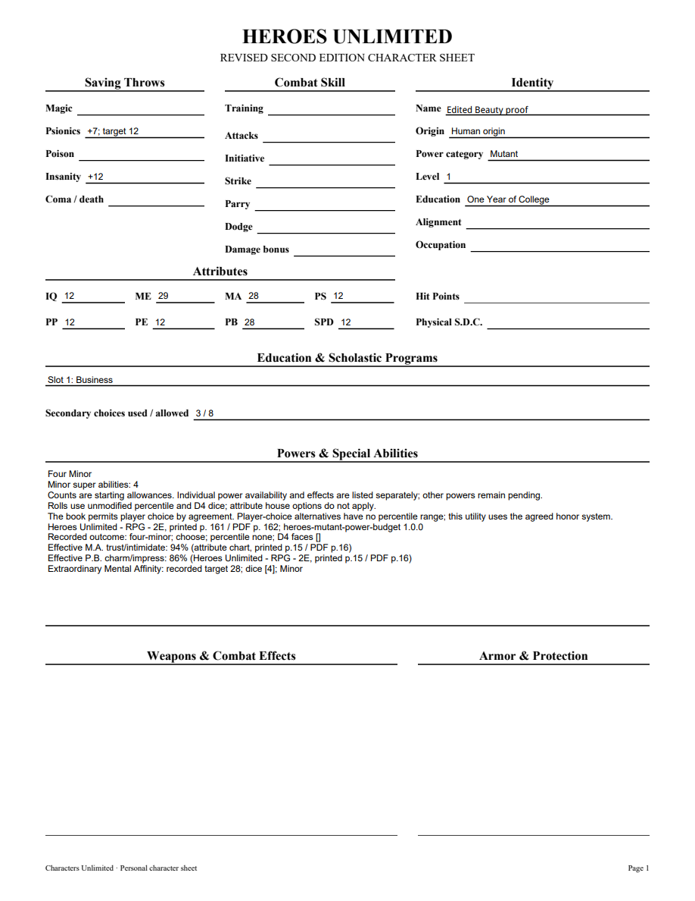
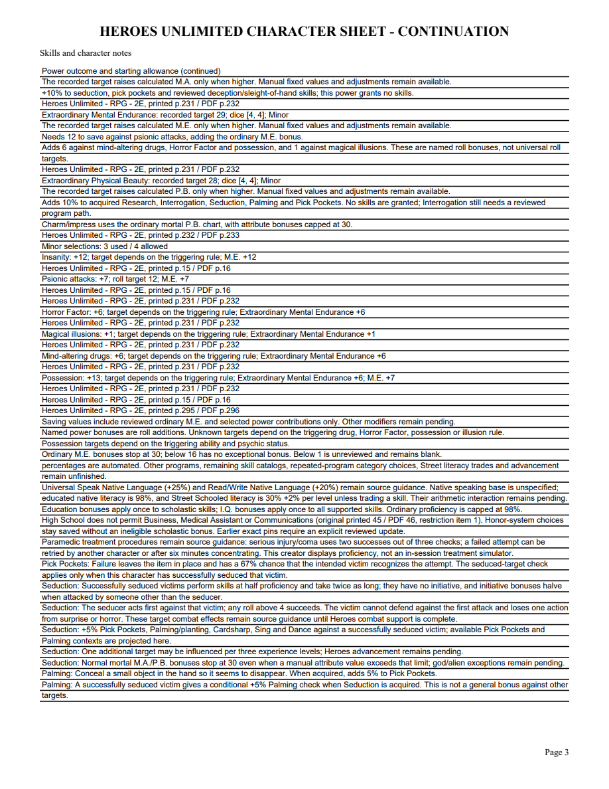

# 09A4 validation

Extraordinary Physical Beauty, the ordinary P.B. chart and Palming were checked against corrected Markdown and rendered original pages. The contract records source candidates and exact printed/PDF locators. The user confirmed retaining the higher calculated score for both M.E. and P.B.

Public tracers first rejected the unavailable power and Palming, then passed. A separate failing upgrade preview became passing when charm changes were included. Five public application tests protect recorded dice, higher/manual values, acquired-skill-only bonuses, stacked M.A./P.B. contributions, Palming synergy, contextual checks, exact historical pins, explicit updates, restart/import and PDF values. Focused 17, 13 and 6-case selections passed during implementation. Final stable full suite: 266 tests in 154.597 seconds, OK with one frozen-only skip. Strict mypy checks 94 files; Python compilation, every browser script syntax check and whitespace checks pass.

An earlier full run had one Windows connection-aborted error in an unauthorized HTTP request test. That exact test passed independently without a server change; the final full run also passed. A review found stale Secondary guidance omitting Palming. The exact wording and canonical manifest hash were repaired and verified. Standards and Spec both APPROVE, with no remaining actionable findings.

After restarting the server, browser reopening showed P.B.28, original D4 faces 4/4, charm86, Research70, Pick Pockets50, Seduction53 and Palming40. Removing P.B. removed its contributions; reselecting restored the original faces and all percentages. The three-page PDF contains matching values, sources and complete continuations. All pages were visually inspected; the final changed continuation and individually edited NAME field were rendered again after saving/reopening. This does not claim Adobe viewer compatibility.

[Editable sample](09a4-beauty-sample.pdf)

Only reviewed chosen M.A., M.E. and P.B. powers are available. Interrogation has no reviewed selectable program path yet. Remaining powers, programs, combat, resources, advancement and full corpus acceptance remain open. Parent09 remains open; this is not final delivery or retrospective.

09A4 merged in PR70 as34ef6c59d84ad6dbd5a1089afb96fdd1e462bb8c after Windows37180579805(5m4s)/37180582307(5m39s) passed, including packaged executable validation.
