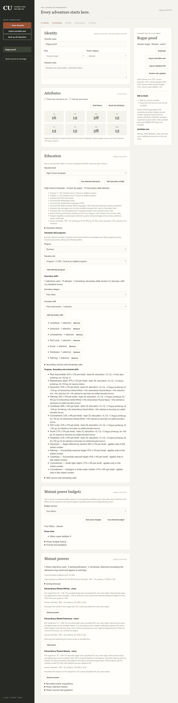
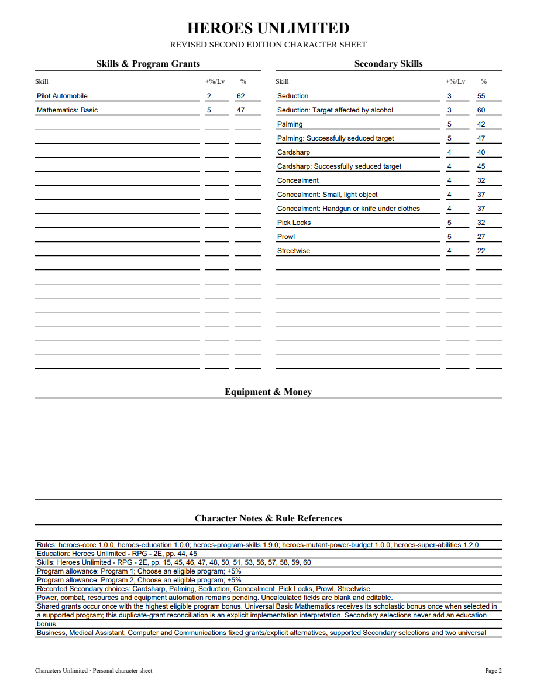
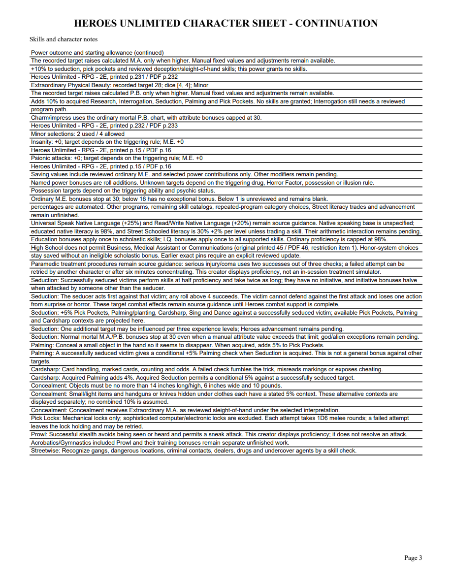

# 09B validation

Cardsharp, Concealment, Pick Locks, Prowl and Streetwise were checked against corrected Markdown and rendered original HU PDF pages 59–60. Streetwise spans printed pages 58–59. Source candidates and worked examples are recorded in the contract. The user's latest answer confirms that Concealment receives Extraordinary M.A. as sleight of hand.

Three public application tracers first rejected unavailable choices, then passed. Five new tests cover separate power contributions, acquired Palming synergy, conditional Seduction/item checks, removing prerequisites for those bonuses, correct skill values/rates, Secondary costs, exact legacy pins, explicit preview/apply, portable reopening and editable PDF fields. The integration test initially expected a context as a single prose string; it now checks the actual separate editable percentage fields. A count fixture was corrected to High School's 10-choice allowance. These were fixture corrections, with no projection-engine change.

Focused 12 tests pass. Final full suite passes 271 tests in 192.784 seconds, with one frozen-only skip. Strict mypy checks 95 files; Python compilation, all JavaScript syntax and whitespace checks pass. Standards and Spec reviews both APPROVE without actionable findings. The new pack is canonically hashed and the old 1.8 version remains available.

Browser reopening at I.Q.16, M.A.28 and P.B.28 shows Cardsharp40 (45 against a seduced target), Concealment32 (37 for each item context), Pick Locks32, Prowl27 and Streetwise22. Removing Palming changes Cardsharp40 to36 and its context45 to41; selecting Palming again through the Rogue category restores them. Seven choices use seven of ten Secondary slots. The three-page PDF shows matching editable values and source guidance. Every original page and the individually edited NAME field were visually inspected after saving/reopening and rendering initialized forms. No Adobe viewer compatibility claim is made.

[Editable sample](09b-rogue-sample.pdf)

Full Rogue catalog, training effects, Heroes advancement, other programs/powers/combat/resources and full corpus acceptance remain open. Parent09 remains open; this is a bounded content slice, not final delivery or retrospective.
