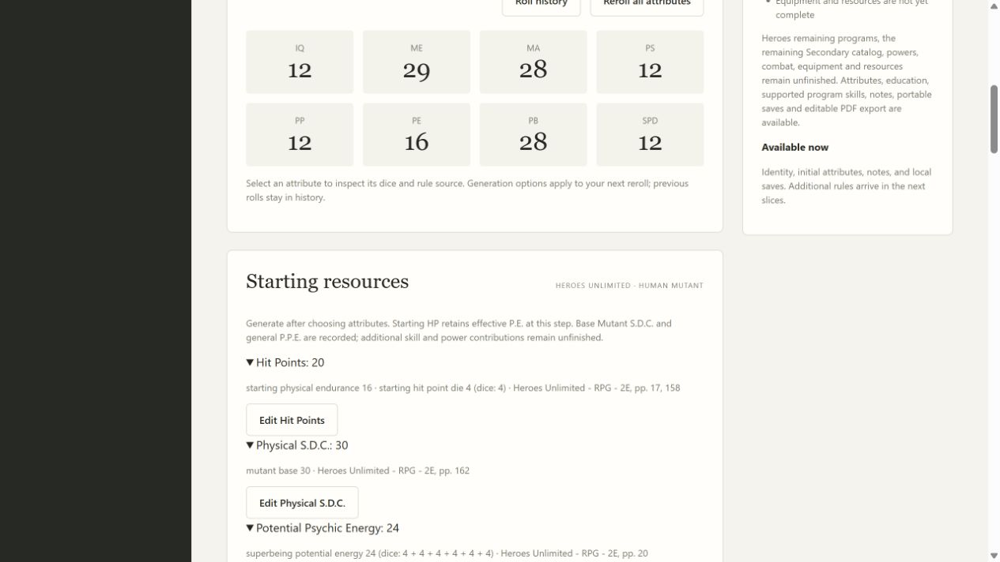
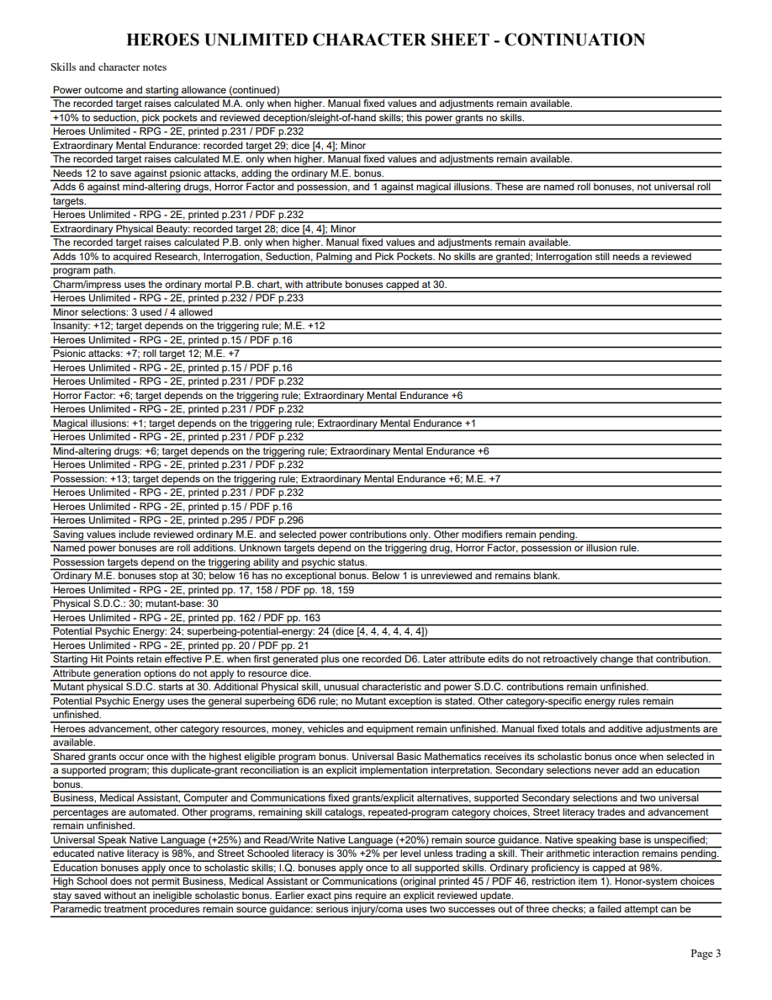

# 09C validation

Human Mutant starting HP, S.D.C. and P.P.E. were checked against corrected Markdown and original PDF pages 18, 21, 159 and 163. HP uses effective P.E. at initial generation plus a recorded D6 under the documented interpretation; base S.D.C. is 30, and general superbeing P.P.E. is 6D6. Resource dice ignore attribute house rules. The independent heroes-resources 1.0 pack is canonically hashed and pinned on generation.

Public application tracers first rejected unavailable generation, missing P.P.E., unvalidated portable resources and blank PDF fields, then passed. Six new tests cover initial P.E. retention, raw dice, manual edits, exact portable reopening, HTTP/revision protection, PDF fields and rejected tampering. A malformed attribute snapshot initially caused an AttributeError; validation now checks snapshot structure before validating retained power contributions, producing a controlled ValueError without changing saves.

Focused 20 tests pass. The final full suite passes 277 tests in 220.794 seconds, with one frozen-only skip. The repository-required mypy --check-untyped-defs check passes 96 files; compilation, all browser-script syntax and whitespace checks pass. An exploratory --strict command reports existing untyped interfaces; it is not the repository's required check. Both independent Standards and Spec reviews APPROVE after repairing outdated PDF wording.

The browser generates HP20 / S.D.C.30 / P.P.E.24 from effective P.E.16 and deterministic four-face dice. HP +5 becomes25 and survives reopening; returning to calculated mode restores20 without rerolling. Expanded rows show the original P.E., resource dice and sources. The four-page PDF shows matching editable HP, S.D.C. and new P.P.E. fields, retained contributions and source guidance. All four original pages and the individually edited NAME field were inspected after save/reopen and form-aware rendering. No Adobe viewer compatibility claim is made.

[Editable sample](09c-resources-sample.pdf)

Physical skills, unusual traits and power resource additions, Heroes advancement, money, vehicles, equipment and full corpus acceptance remain open. Parent09 remains open. Windows CI checks are pending.

09C merged in PR72 as ab45fca533753bb52425c085b68910ca51613f12 after Windows37183026472(6m12s)/37183044312(7m46s) passed, including packaged executable validation.
