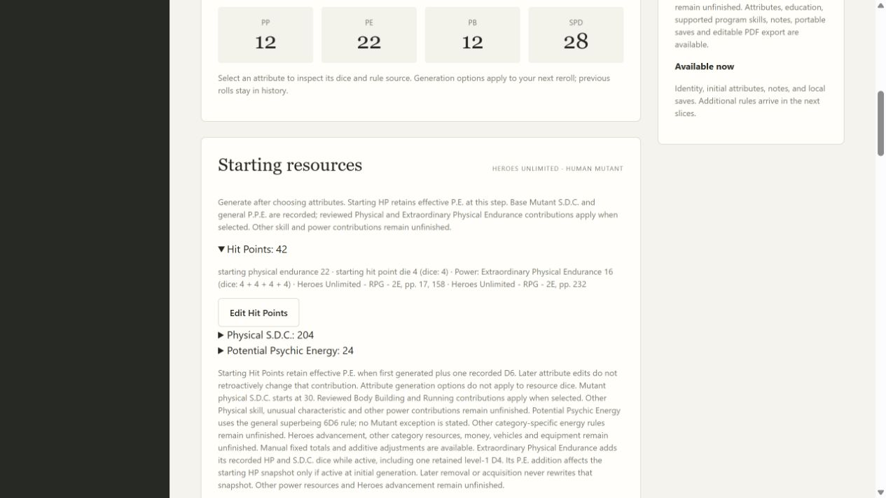
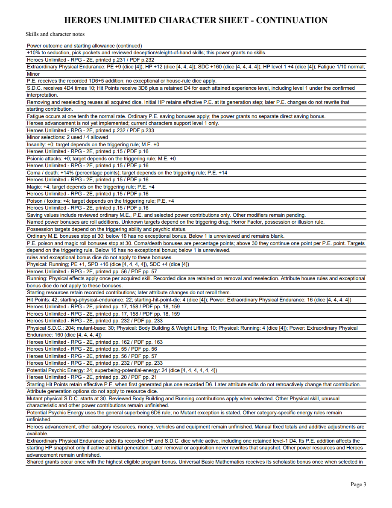

# 09D validation

Extraordinary Physical Endurance was checked against original HU printed232/PDF233: additive P.E.1D6+5, S.D.C.4D4x10, HP3D6 plus1D4 per experience level, and fatigue one tenth normal. The user confirmed level1 is included and rolls are retained for reselection. Ordinary P.E. chart and beyond30 behavior were visually verified on printed15–16/PDF16–17. New locators/fingerprints use the checked-in Markdown snapshot02927f54…; the external pipeline has a newer shifting snapshot, which is not attributed to the older inventory candidate. The full power range13887–13897 includes bonuses beyond the truncated heading candidate.

The application tracer first rejected the unavailable power, then passed with source-bound multi-formula receipts and independent active HP/S.D.C. projection. Separate saving/PDF tracers failed for unavailable PE saves and blank fields before implementation. A draw-order assertion was changed to check the required dice multiset because canonical pack storage sorts resource keys; ordering carries no rule meaning. Two edge-test fixture mistakes (infinite ones for an attribute reroll, and choosing a history frame before any modifier existed) were corrected. Focused validation found an existing synthetic future-version collision with real1.3; it now uses99.0.0, while the actual update expectation is1.3.

Seven new public workflow tests cover level1D4, duplicate prevention/reselection, late vs initial acquisition, raw bonus dice despite house options, manual attribute/resource precedence, other power coexistence, current/history/resource-snapshot/source tampering, bad/missing/extra dice, old exact pins and inactive-definition update rejection, HTTP token/revision checks and editable PDF saving units/blank ungenerated resources. Forty focused tests pass. Required mypy --check-untyped-defs passes100 files; compile, all browser-script syntax and whitespace checks pass. Both independent review axes approve. Final full suite passes297 tests in232.618 seconds, with one frozen-only skip. Windows checks pending.

Browser worked example with Body Building/Running plus endurance: P.E.22, HP42, S.D.C.204, P.P.E.24. Removing endurance gives P.E.13, HP26, S.D.C.44; initial HP's P.E.22 contribution stays recorded. Reselection restores the same dice/totals. Browser reload/reopening and a fresh application instance retain receipts. The four-page editable PDF matches these totals, magic/poison+4 and coma+14% (percentage points), and clearly separates additive power receipts from target-floor powers. Every original page and an individually edited NAME widget were rendered with forms initialized and inspected after save/reopen. No Adobe viewer compatibility claim is made.

[Editable sample](09d-endurance-sample.pdf)

Heroes advancement remains open; current characters support only level1 and reject unearned level dice. The per-level definition and confirmed ruling remain explicit for the later advancement slice. Full powers/category construction, combat and corpus acceptance remain open; parent09/07 remain open.
