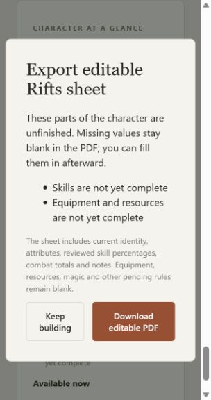
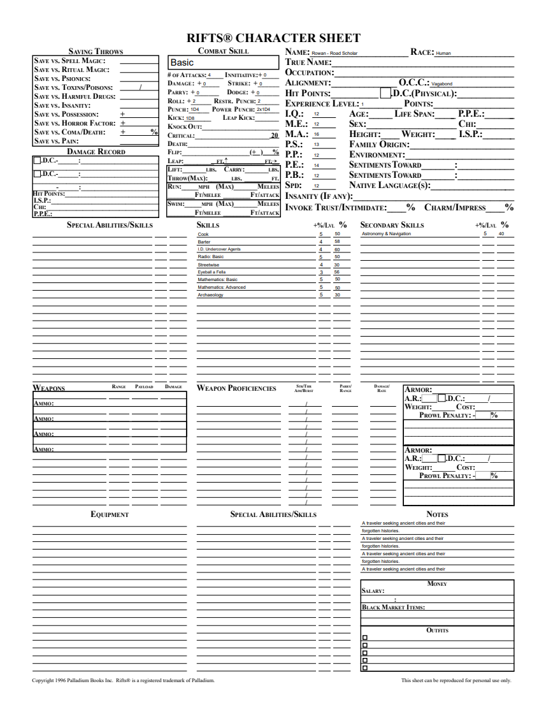
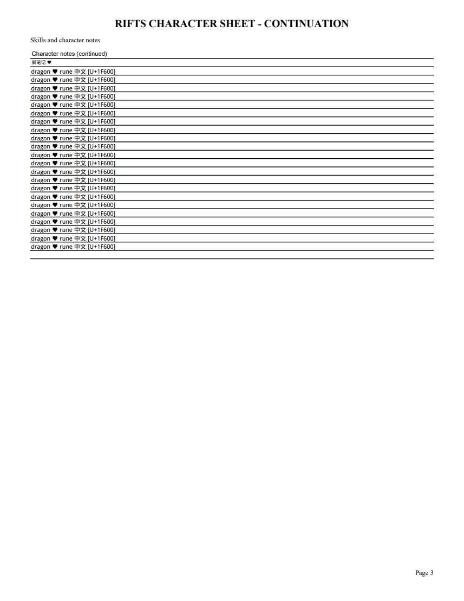

# 20A editable Rifts PDF validation

The application exports the supplied monochrome Rifts sheet with supported identity, attributes, skills, combat training, and notes. Missing resources and equipment remain blank. Shared original parents and appearances are separated so edits affect only their own cells. Overflow checks and long notes use editable continuation pages. The packaged template SHA256 is F4FDBF0E47321EB1CB3DB6C9385FA530F2616E4A83D4BC6C440A27D0EC7F1C34, matching the original reference.

Validation: 88 unittest checks, mypy across 32 files, Python compilation and JavaScript syntax checks pass. Artifact tests verify canonical field values against widgets, unique populated appearances, independent edits, save/reopen, and unchanged saved characters. HTTP checks verify PDF content type and readable PDF bytes. PDFium (forms initialized) rendered all six long-sample pages and the short sample; all pages were inspected. The original artwork is preserved, and continuation headings, rows and footers remain readable.

The review caught two Unicode failures: ReportLab Helvetica rejected heart/CJK notes, and initial Unicode appearances reverted to Helvetica after edits. The export now embeds the licensed Droid Sans Fallback font, including a Type0 Identity-H editing font and CID-to-glyph mapping. Chinese/Cyrillic names and heart/CJK continuation notes were edited with pypdf, saved/reopened, and rendered successfully. Characters outside the bundled font use explicit Unicode code labels in initial appearances while retaining the exact editable value. Coverage beyond the font's repertoire is limited; this does not claim all Unicode glyphs or complex-script shaping.

The local browser displayed the unfinished-parts checklist and accepted Download with no UI error. Its download event timed out, so actual browser filesystem delivery remains unverified in this environment. The HTTP/artifact path is verified; the Windows release acceptance must verify an actual browser download. Parent 20 also remains open for full equipment/resources/magic/attack projection and Heroes Unlimited sheets.

Font source and unchanged binary license are recorded in `characters_unlimited/fonts/README.md` and `NOTICE`.
