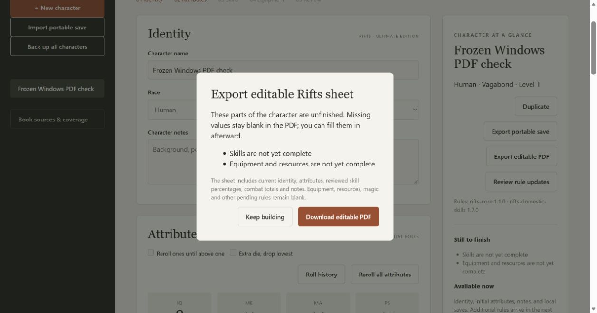

# 23A frozen Windows package validation

The onedir package bundles Python 3.14, the browser application, exact accepted rule packs, coverage metadata, PDF template, Unicode fonts, and runtime/dependency licenses. The desktop controller opens the workshop and offers a stop control. Data remains separate under the existing user-data directory.

The actual executable was launched from a temporary unrelated working directory with PATH limited to Windows System32. Headless and desktop-controller startup passed. HTTP checks exercised create/save/reopen, browser assets, source coverage, portable export/import, PDF export and canonical fields. A second launch reopened both saved characters. A bound-port failure exited with code 1 and wrote a diagnostic log. All 89 checks, mypy over 34 files, compilation and JavaScript syntax checks pass, with the packaged test enabled.

Tcl cannot see the workspace inside the Codex command sandbox even when Python can; its directory probe returns 0 there and 1 outside it. GUI validation therefore ran with approved unsandboxed execution. The same frozen executable passed without a product repair for this environment restriction. A clean build is used to prevent stale build analysis.

A normal Windows launch started the service; a fresh Edge tab visited it, rolled and saved Frozen Windows PDF check, displayed the unfinished-parts checklist, and downloaded the editable PDF. The event helper timed out, but the actual file in Downloads reopened with the correct name, two pages and 1,140 canonical fields. This also completes 20A's remaining browser delivery check.

Both Standards and Spec reviews approve. Windows CI now builds and exercises the frozen executable, then retains an early package artifact for 14 days. This is the current Rifts Human/Vagabond build. Heroes Unlimited, advancement, complete supplied content and final offline release acceptance remain open. Desktop-controller appearance and its stop button still require final native visual/interaction acceptance; the GUI startup and packaged resources were verified here.

Build approach: [PyInstaller's official documentation](https://www.pyinstaller.org/en/stable/) describes standalone bundles with no player-side Python installation. The build pins PyInstaller 6.22.3 and its hooks; dependency and Python license notices are included.
